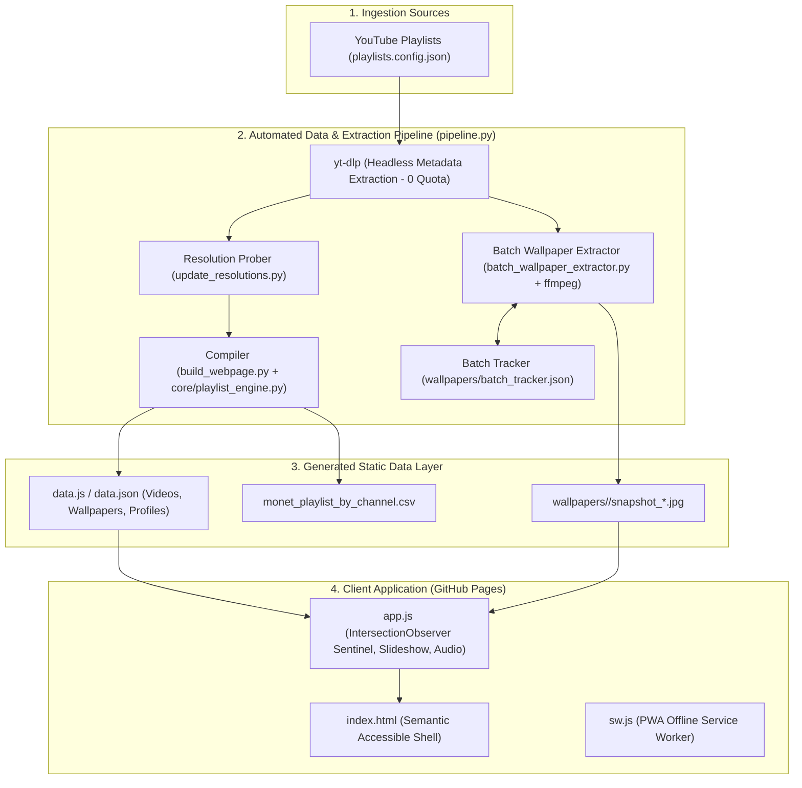

# 🎨 L'Impressionnisme Vivant
### *The Impressionist Video Explorer & 4K Wallpaper Archive*

[](https://lgtkgtv.github.io/monet-living-gallery/)
[](https://lgtkgtv.github.io/monet-living-gallery/)
[](https://lgtkgtv.github.io/monet-living-gallery/)
[](https://lgtkgtv.github.io/monet-living-gallery/)
[](https://lgtkgtv.github.io/monet-living-gallery/)
[](https://github.com/lgtkgtv/monet-living-gallery)
[](https://github.com/lgtkgtv/monet-living-gallery)
[](https://lgtkgtv.github.io/monet-living-gallery)

An interactive, curated digital museum and ultra-high-definition visual archive celebrating **Claude Monet** and the **Impressionist art movement**. 

Derived from curated YouTube collections (beginning with [sh_Monet inspired Visual Arts](https://www.youtube.com/playlist?list=PLeqGkucOU6lA)), the gallery catalogs **220 masterworks** across **41 distinct artistic channels**, delivering high-definition video curation, an extensive high-resolution wallpaper archive (**100% 4K UHD & 100% 1080p FHD coverage; 1,780 active catalog wallpapers / 1,886 in archive**), fullscreen cinematic Ken Burns slideshow motion, atmospheric classical audio, and seamless cross-device collection sharing.

🌐 **Live Web Application**: **[https://lgtkgtv.github.io/monet-living-gallery/](https://lgtkgtv.github.io/monet-living-gallery/)**

---

## 🧭 Navigation & Overview

- [👤 User's Perspective (Visitor & Art Lover's Guide)](#-users-perspective-visitor--art-lovers-guide)
  - [1. 🎨 The Living Gallery & 4K UHD Masterworks](#1--the-living-gallery--4k-uhd-masterworks)
  - [2. 🔍 Catalog-Driven Artist & Motif Exploration](#2--catalog-driven-artist--motif-exploration)
  - [3. 💡 Proactive Search Conflict Assistance & Educational Discovery](#3--proactive-search-conflict-assistance--educational-discovery)
  - [4. 🖼️ Ken Burns Wallpaper Slideshow & Ambient Music](#4-️-ken-burns-wallpaper-slideshow--ambient-music)
  - [5. 💾 Instant Bulk Downloads & Adaptive Wallpapers](#5--instant-bulk-downloads--adaptive-wallpapers)
  - [6. ❤️ Saved Collections & Cross-Device Sharing](#6-️-saved-collections--cross-device-sharing)
  - [7. ⚖️ Ethical Attribution & Copyright Transparency](#7-️-ethical-attribution--copyright-transparency)
  - [8. 🧹 Multi-Cut De-cluttering & Redundant Segment Management](#8--multi-cut-de-cluttering--redundant-segment-management)
- [💻 Developer's Perspective (Architecture & Engineering Guide)](#-developers-perspective-architecture--engineering-guide)
  - [1. 🏛️ Core Architecture & Data Pipeline](#1-️-core-architecture--data-pipeline)
  - [2. ☁️ Wallpaper Storage & Scalability Architecture (Git vs LFS vs Cloudflare R2)](#2-️-wallpaper-storage--scalability-architecture-git-vs-lfs-vs-cloudflare-r2)
  - [3. 📚 Generic Multi-Playlist Engine (`core/`)](#3--generic-multi-playlist-engine-core)
  - [4. 🏷️ Taxonomic Catalog & Copyright Engine (`build_webpage.py`)](#4-️-taxonomic-catalog--copyright-engine-build_webpagepy)
  - [5. 🧹 Duplicate Title & Multi-Cut Clustering Engine (`build_webpage.py` & `pipeline.py`)](#5--duplicate-title--multi-cut-clustering-engine-build_webpagepy--pipelinepy)
  - [6. 🖼️ Headless Wallpaper Extraction & Anti-Throttling Engine](#6-️-headless-wallpaper-extraction--anti-throttling-engine)
  - [7. 🤖 GitHub Actions Workflow Dispatch & Automation](#7--github-actions-workflow-dispatch--automation)
  - [8. ⚡ Client-Side Performance & DOM Virtualization](#8--client-side-performance--dom-virtualization)
  - [9. 🧪 Test Suite & Quality Verification (26 Integration Tests)](#9--test-suite--quality-verification-26-integration-tests)
  - [10. 🛠️ Unified Pipeline CLI Reference (`pipeline.py`)](#10-️-unified-pipeline-cli-reference-pipelinepy)
- [📁 Repository Structure](#-repository-structure)
- [📜 License & Curator Credits](#-license--curator-credits)

---

## 👤 User's Perspective (Visitor & Art Lover's Guide)

Whether you are seeking quiet study accompaniment, high-resolution desktop backgrounds, or an art history exploration, *L'Impressionnisme Vivant* is crafted as a contemplative, museum-grade experience.

```
+---------------------------------------------------------------------------------------------------+
|  🎨 L'Impressionnisme Vivant — The Impressionist Living Gallery                                    |
|                                                                                                   |
|  [🎨 Artist: All Masters (18)]  [🏛️ Theme: All Motifs (10)]  [👑 4K UHD]  [⚖️ All Licenses]       |
|  [Artist Chips: Monet | Sisley | Boudin...]   [Theme Chips: Water Lilies | Giverny | Snow...]     |
+---------------------------------------------------------------------------------------------------+
|  [ 🎬 Video Masterworks Tab ]    [ 🖼️ Wallpaper Archive Tab ]    [ 🏛️ Channel Guides Tab ]        |
|                                                                                                   |
|  +--------------------+  +--------------------+  +--------------------+  +---------------------+  |
|  |  [4K UHD Badge]    |  |  [4K UHD Badge]    |  |  [FHD Badge]       |  |  [4K UHD Badge]     |  |
|  |  Water Lilies 1916 |  |  Woman with Parasol|  |  Autumn on Seine   |  |  Gare Saint-Lazare  |  |
|  |  ▶ Play  🖼️ Stills |  |  ▶ Play  🖼️ Stills |  |  ▶ Play  🖼️ Stills |  |  ▶ Play  🖼️ Stills  |  |
|  +--------------------+  +--------------------+  +--------------------+  +---------------------+  |
+---------------------------------------------------------------------------------------------------+
```

### 1. 🎨 The Living Gallery & 4K UHD Masterworks
- **Default Native 4K Experience**: The gallery defaults to filtering by **Native 4K UHD (3840×2160)**, instantly presenting 58 museum-grade living canvases where individual impasto brushstrokes and canvas textures are rendered with cinematic fidelity.
- **Midnight Gallery Dark Theme**: The interface defaults to an immersive deep midnight slate palette (`#0a0e14`) paired with authentic French cursive calligraphy headings. Canvases illuminate the screen without glare or visual distractions. A 1-click toggle switches to **Classic Museum Parchment** mode if preferred.

### 2. 🔍 Catalog-Driven Artist & Motif Exploration
- **Master Artist Selector (`#artistSelect`)**: A dedicated dropdown indexing 18 Impressionist and Realist masters (Claude Monet, Vincent van Gogh, Alfred Sisley, Eugène Boudin, Gustave Loiseau, Isaac Levitan, Edouard-Léon Cortès, Victor Bykov, and more) with item counts and resolution hints.
- **Theme & Motif Selector (`#themeSelect`)**: Directly filter works by classic Impressionist subjects: *Water Lilies & Lotus Ponds*, *Rivers, Seascapes & Coastal Cliffs*, *Gardens & Floral Landscapes*, *Winter Snow & Frost*, *Paris Streets & Urban Life*, *Rural Countryside & Meadows*, and more.
- **Dedicated Channel Guides Tab**: Jump between the gallery and the **🏛️ Channel Guides** tab to explore detailed aesthetic profiles for 41 curating channels (*LearnFromMasters*, *Extraordinary Visual Art*, *Muse Visual Art*, *Painters Dream*, *Cupid Studio*, *Beautiful Living Art*, etc.), detailing their visual style, musical tone, and curatorial focus.

### 3. 💡 Proactive Search Conflict Assistance & Educational Discovery
The central mission of this gallery is art appreciation, historical contemplation, and self-education. The search and filter system actively assists visitors:
- **Intelligent Auto-Resolution Relaxation**: 14 of the 18 masters have their works preserved in 1080p Full HD rather than 4K. When you select an artist like **Alfred Sisley** or **Eugène Boudin**, the gallery automatically expands the resolution filter from 4K to **All Resolutions** and displays a gentle toast notification (`🎬 Switched to All Resolutions: Alfred Sisley masterworks are available in 1080p Full HD`) rather than leaving you with an empty screen.
- **1-Click Search Conflict Recovery**: If your search matches paintings in other resolutions or channels that are currently filtered out, the gallery presents an immediate 1-click button (e.g. `🎬 View in All Resolutions (12)` or `📺 Search Across All Channels`).
- **Uncataloged Artist Discovery**: If you search for an Impressionist master not present in this specific 220-title exhibition (such as **Camille Pissarro**, **Paul Cézanne**, or **Berthe Morisot**), the gallery presents an educational guidance card explaining the exhibition scope along with clickable discovery pills to explore our 18 featured artists.

### 4. 🖼️ Ken Burns Wallpaper Slideshow & Ambient Music
- **Cinematic Ken Burns Motion**: When entering the fullscreen slideshow, high-resolution masterworks come alive with gentle, slow-panning and subtle zooming transitions, simulating an intimate gallery stroll.
- **Ambient Classical Soundtrack**: Curated background suites by Claude Debussy (*Clair de Lune*, *Première Arabesque*), Erik Satie (*Gymnopédie No. 1*), and Maurice Ravel (*Pavane pour une infante défunte*).
- **Strict Audio Isolation**: Clicking play on any YouTube video automatically mutes/pauses the ambient audio track, ensuring you hear the original video’s authentic audio design without overlapping noise.
- **Keyboard Shortcuts**:
  - `Space`: Pause / Resume Slideshow
  - `ArrowLeft` / `ArrowRight`: Previous / Next Wallpaper
  - `A`: Toggle Ambient Classical Music (Mute / Unmute)
  - `N`: Skip to Next Audio Track
  - `D`: Toggle Display Mode (Fit Entire Canvas vs Fill Screen)
  - `Esc`: Exit Fullscreen Slideshow

### 5. 💾 Instant Bulk Downloads & Adaptive Wallpapers
- **Adaptive Form Factors**: Snapshots are automatically categorized into **Desktop Widescreen (16:9)** and **Mobile Portrait** formats.
- **Client-Side Bulk ZIP**: Filter wallpapers by artist, motif, channel, or resolution and download them in a single `.zip` file generated right in your browser via `JSZip`—no wait time, no server uploads.

### 6. ❤️ Saved Collections & Cross-Device Sharing
- **Private Bookmarking**: Tap the heart icon on any work or wallpaper to curate your private favorites list, saved locally in your browser (`localStorage`).
- **Seamless Cross-Device Sync**: Share your curated collection between your phone, laptop, or tablet using one-click JSON export/import or shareable URL links.

### 7. ⚖️ Ethical Attribution & Copyright Transparency
- **Card Rights Badges**: Each wallpaper snapshot displays clear licensing badges (`✅ Free DL` for Public Domain works, `🔒 View Only` for Copyright Reserved titles).
- **Lightbox Rights Banner**: Opening any wallpaper lightbox reveals an attribution banner indicating public domain status or creator reservation.
- **Encountered Copyright on Download**: Single wallpaper downloads trigger an attribution toast (`⚖️ Downloading wallpaper for personal contemplation · Artwork in Public Domain · Channel: ...`).
- **Bundled Attribution Document**: All single-video and bulk ZIP downloads bundle an official `COPYRIGHT_AND_ATTRIBUTION.txt` detailing public domain masterwork status, originating YouTube channels, and personal non-commercial contemplation terms.
- **Copyright Filter (`#copyrightSelect`)**: Easily filter the gallery to show only titles with free wallpaper downloads or explore view-only copyright-reserved titles.

### 8. 🧹 Multi-Cut De-cluttering & Redundant Segment Management
YouTube creators frequently release the same artwork across multiple cuts and segment lengths (e.g. 2-minute short teaser clips vs 3.5-minute extended cuts, or series uploads like *Piece 17*, *Piece 36*, and *Piece 38* for Monet's *Enter a Renoir Painting*).
- **Automatic De-clutter Mode (`#declutterSelect`)**: Active by default (`🧹 De-clutter (Primary Cuts Only)`), the gallery automatically collapses redundant segment uploads down to the definitive primary cut—prioritizing native 4K UHD resolutions, complete runtimes, and full wallpaper archives.
- **Card Multi-Cut Badges**: Masterworks with alternative cuts display an informative badge in the card metadata: `🎞️ 4 Cuts (02:06 · 03:29 · 02:05)`. In full-catalog mode, alternate cuts are explicitly labeled with `✂️ Alternate Cut`.
- **In-Player Alternate Cuts Switcher**: When viewing any painting in the embedded video player lightbox, an interactive **🎞️ Alternate Cuts** toolbar appears directly below the player frame, allowing visitors to switch between different cuts, durations, and resolutions with a single click.
- **Toggle to Show All Cuts**: Select `📑 Show All Cuts (Include Alternates)` in the dropdown at any time to browse all 220 uploads without collapsing.

---

## 💻 Developer's Perspective (Architecture & Engineering Guide)

*L'Impressionnisme Vivant* is engineered as a zero-maintenance, zero-API-cost static site with an automated Python metadata & frame-extraction pipeline and a robust client-side rendering engine.

### 1. 🏛️ Core Architecture & Data Pipeline



### 2. ☁️ Wallpaper Storage & Scalability Architecture (Git vs LFS vs Cloudflare R2)
As the gallery visual archive expands across multi-channel and multi-resolution tiers (~1,886 snapshots currently; projecting 5,000+ snapshots across future playlists), storage and egress bandwidth require deliberate architectural choices:

| Architecture | Storage Capacity | Free Egress / Bandwidth | Latency / CDN | Best Used For |
| :--- | :--- | :--- | :--- | :--- |
| **A. Direct Git Storage** *(Current)* | Up to 1 GB per repository | Unlimited via GitHub Pages CDN | Global Fastly Edge | Single-playlist exhibitions (<2,000 images, ~450 MB) |
| **B. Git LFS** (Large File Storage) | 1 GB total storage | 1 GB/month free bandwidth limit | Standard GitHub LFS CDN | Media files with strict git-level version tracking |
| **C. Cloudflare R2 + CDN** *(Scale Ready)* | 10 GB free permanent storage | **$0.00 Egress Fees** (Zero Bandwidth Cost) | Global Cloudflare 300+ Edge POPs | Multi-playlist catalogs (>5,000 images, >2 GB) |
| **D. AWS S3 + CloudFront** | 5 GB for 12 months | 1 TB/month CloudFront free tier | AWS CloudFront Edge | Enterprise cloud architectures |

#### Architectural Strategy:
1. **Current Scale (<2,000 wallpapers, ~421 MB)**: Direct Git storage under `wallpapers/<videoId>/snapshot_*.jpg` serves directly from GitHub Pages without external infrastructure, API tokens, or billing dependencies.
2. **Future Multi-Playlist Expansion (>2 GB)**: When cataloging 5,000+ artworks across multiple playlists, migrate image assets to **Cloudflare R2**. Because Cloudflare R2 charges **$0.00 for data egress** (unlike AWS S3), a high-traffic art gallery can serve millions of high-resolution wallpaper downloads with zero bandwidth cost. The frontend is built to support this seamlessly by prepending an optional `const WALLPAPER_CDN_BASE = ""` prefix in `config.js`.

### 3. 📚 Generic Multi-Playlist Engine (`core/`)
The architecture has been decoupled from single-playlist hardcoding into a reusable engine capable of ingesting arbitrary YouTube playlists:

- **`playlists.config.json`**:
  ```json
  [
    {
      "id": "PLeqGkucOU6lA",
      "title": "sh_Monet inspired Visual Arts",
      "url": "https://www.youtube.com/playlist?list=PLeqGkucOU6lA",
      "category": "Impressionism & Claude Monet",
      "enabled": true
    }
  ]
  ```
- **`core/playlist_engine.py`**:
  - Validates playlist URLs and IDs.
  - Normalizes catalog entries, tracking which playlist(s) each video originates from (`sourcePlaylistIds`).
  - Merges video records and deduplicates cross-listed works.
  - Dynamically injects playlist metadata into `data.js` and activates the `#playlistSelect` filter in the web UI when multiple playlists are registered.

### 4. 🏷️ Taxonomic Catalog & Copyright Engine (`build_webpage.py`)
- **Master Artist Taxonomy (`CATALOG_ARTISTS`)**: 18 curated masters with normalized queries, icon motifs, and calculated resolution distribution counts (`count4K`, `countFHD`, `wallpapersCount`).
- **Impressionist Motif Taxonomy (`CATALOG_THEMES`)**: 10 recurring artistic motifs with semantic synonyms mapping visual subjects (e.g. *Water Lilies*, *Coastal Cliffs*, *Winter Snow*, *Giverny Gardens*).
- **Automated Copyright Tracking**: Classifies video and wallpaper assets as either Public Domain with free downloads or Copyright Reserved (View-Only), ensuring licensing clarity across the UI and export tools.

### 5. 🧹 Duplicate Title & Multi-Cut Clustering Engine (`build_webpage.py` & `pipeline.py`)
To eliminate visual clutter caused by creator channels posting different segment cuts, trailers, or re-uploads of the same artwork, `build_webpage.py` incorporates an automated clustering and primary cut detection pipeline:
- **Title Normalization Pipelines**:
  - `normalize_exact_title(t)`: Case folds, normalizes quotes (`“`, `”`, `‘`, `’`), strips resolution suffixes (`(4K)`, `(1080p)`, `(HD)`), and condenses whitespace to detect identical re-uploads across playlists.
  - `clean_canonical_title(t)`: Strips episode, piece, volume, and series suffixes (e.g. `| Monet Living Art Piece 38`, `| AI Living Art Piece 37`, `| Living Art and Music 8`, `| Warm Relaxing...`) to expose the fundamental canvas subject.
- **Graph-Based Connected Component Clustering (`detect_duplicate_clusters`)**:
  - Evaluates pairwise relationships: pairs are grouped into a cluster if their exact normalized titles match, OR if they originate from the same creator channel and share the identical canonical artwork stem.
- **Deterministic Primary Cut Selection**:
  - Within each cluster, candidate cuts are sorted via a 4-tier ranking key:
    1. **Native 4K First** (`is4K`): Native 3840×2160 takes priority over 1080p FHD.
    2. **Full Runtime First** (`durationSec`): Extended complete editions take precedence over short 1–2 minute teaser snippets.
    3. **Wallpaper Coverage First** (`wallpaperCount`): Titles with pre-extracted high-resolution stills are favored.
    4. **Community Engagement First** (`views`): Higher view count breaks any remaining ties.
- **Data Contract & UI Interoperability**:
  - Every video is enriched with `declutterPrimary: boolean`, `hasAlternateCuts: boolean`, and a `duplicateGroup: { groupId, canonicalStem, isPrimary, totalCuts, cuts: [...] }` payload.
  - Wallpapers inherit `declutterPrimary` from their parent video, guaranteeing that de-cluttering filters both the video explorer and wallpaper gallery consistently.
  - `PLAYLIST_METADATA` exports `totalDuplicateGroups`, `alternateCutsCount`, and `declutteredVideosCount`.
- **Command-Line Duplicate Telemetry**:
  - Run `python3 pipeline.py --detect-duplicates` to inspect all detected clusters, quality labels, runtimes, and primary designations directly in the console.

### 6. 🖼️ Headless Wallpaper Extraction & Anti-Throttling Engine
Wallpaper scenes are extracted directly from video streams without consuming YouTube Data API quota:
- **Zero API Quota**: Uses `yt-dlp` to obtain direct CDN stream URLs and `ffmpeg` to extract uncompressed intra-frame stills.
- **Intelligent Scenery Sampling**: Timestamp calculation dynamically adapts to video length:
  - Short (<4 min): 7 scenes
  - Medium (4–15 min): 9 scenes
  - Long (15–60 min): 12 scenes
  - Anthologies (>60 min): 16 scenes
- **Luminosity Margin Sampling (`detect_form_factor`)**: Automatically categorizes stills as `desktop` widescreen (16:9) or `mobile` portrait by inspecting boundary luminosity for black letterboxing/pillarboxing bars.
- **Anti-Throttling Pacing**: Configurable request delay with randomized jitter (`delay + uniform(0.5, 2.0)`) prevents HTTP 429 rate limiting.
- **Automated Bot-Challenge Fallback (`youtube:player_client=android`)**: If standard web requests encounter YouTube's anti-bot verification challenge (*"Sign in to confirm you're not a bot"*), the extraction engine automatically falls back to YouTube's Android player client API. This resolves the challenge headlessly with 0 manual intervention and no login sessions required.
- **Browser & Session Cookie Integration**: Supports `--cookies-from-browser <browser>` (e.g. Chrome, Firefox) and `--cookies <file>` (Netscape cookies.txt) for environments requiring explicit session authentication.
- **Stateful Resumption & Retry**: `wallpapers/batch_tracker.json` records status per video (`completed`, `in_progress`, `pending`, `failed`) allowing interruption-tolerant multi-day extractions. The `--retry-failed` flag quickly resets failed titles to re-attempt extraction with updated fallbacks.
- **Copyright Exclusion Flag**: The extractor supports `--skip-copyright-restricted` to automatically exclude video titles or channels with copyright reservations (e.g. *Living Art Moments*) from batch extraction runs.

### 7. 🤖 GitHub Actions Workflow Dispatch & Automation
The repository includes automated CI/CD workflows under `.github/workflows/`:
- **`sync.yml`**: Full-featured workflow supporting both automated weekly runs and manual on-demand execution (`workflow_dispatch`):
  ```yaml
  on:
    schedule:
      - cron: '0 4 * * 0'   # Weekly at 04:00 UTC
    workflow_dispatch:
      inputs:
        action:
          description: 'Sync Action to execute'
          required: true
          default: 'sync'
          type: choice
          options: [sync, pull, resolutions, extract, build]
        batch_size:
          description: 'Wallpaper extraction batch size'
          required: false
          default: '10'
        quality_tier:
          description: 'Resolution tier filter'
          required: false
          default: 'fhd'
          type: choice
          options: [all, 4k, fhd]
  ```
- Installs `ffmpeg` and `yt-dlp`, executes the pipeline, and commits updated datasets and extracted wallpapers back to `main`.

### 8. ⚡ Client-Side Performance & DOM Virtualization
- **Fast Initial Paint**: Initial render creates only 24 video cards via `DocumentFragment`.
- **`IntersectionObserver` Sentinel**: Seamlessly loads subsequent 24-card increments as the user scrolls within 400px of the page bottom, maintaining 60 FPS even across hundreds of items.
- **Focus Trapping & Accessibility**: Full WCAG compliance with keyboard trap utilities (`trapModalFocus`, `restoreFocus`), screen-reader live announcements (`aria-live="polite"`), and clear focus rings.
- **PWA Service Worker (`sw.js`)**: Cache-First strategy for images, CSS, and audio; Network-First with offline fallback for application data.

### 9. 🧪 Test Suite & Quality Verification (26 Integration Tests)
The project includes an end-to-end integration test suite in [`tests/test_gallery.js`](tests/test_gallery.js) executing against a simulated DOM environment:

```bash
node tests/test_gallery.js
```

**26 Verified Test Cases**:
1. Video card rendering & DOM batch threshold (>=24 cards)
2. Results counter formatting
3. Wallpaper grid tab switching
4. Saved favorites empty state
5. Channel guides tab navigation (toggle & return)
6. Channel card filter triggers
7. Video modal open/close lifecycle
8. Wallpaper modal open/close lifecycle
9. Legal modal open/close lifecycle
10. Simplified curator contact formatting
11. Search filtering accuracy
12. **Strict audio isolation** (ambient classical paused while video player active)
13. Corrupted `localStorage` ID auto-purge
14. Favorite addition and persistence
15. Favorite tab rendering of saved items
16. Favorite clear all and state reset
17. Channel copyright download prohibition enforcement
18. Default 4K resolution filter verification
19. Action bar visibility toggling
20. Cross-device collection sharing import/export
21. **Artist dropdown filter & auto-resolution relaxation** (switches from 4K to ALL for 1080p artists)
22. **Theme/motif dropdown filter** (indexes 10 Impressionist motifs)
23. **Copyright isolation filter** (`VIEW_ONLY` vs `DOWNLOADABLE`)
24. **Smart search conflict assistance & educational discovery pills** (for uncataloged artists)
25. **Wallpaper modal rights banner & ZIP download attribution generation** (`COPYRIGHT_AND_ATTRIBUTION.txt`)
26. **Multi-Cut & Duplicate Title De-cluttering** (detection, filtering, card badges, modal cuts switcher bar)

### 10. 🛠️ Unified Pipeline CLI Reference (`pipeline.py`)

```bash
# Display comprehensive archive telemetry (videos, 4K count, channels, wallpapers)
python3 pipeline.py --status

# Detect duplicate titles, re-uploads, and multi-length segment cuts
python3 pipeline.py --detect-duplicates

# Recompile data.js, data.json, and CSV catalog from current metadata
python3 pipeline.py --build

# Pull latest playlist updates directly from YouTube (multi-playlist enabled)
python3 pipeline.py --pull-playlist

# Audit and probe native resolutions for newly added titles
python3 pipeline.py --sync-resolutions

# Extract wallpaper batch for 1080p FHD tier with rate-limit delay
python3 pipeline.py --extract --tier FHD --batch-size 15 --delay 2.0

# Extract wallpaper batch excluding copyright-restricted channels
python3 pipeline.py --extract --tier ALL --batch-size 15 --delay 2.0 --skip-copyright-restricted

# Re-attempt failed extractions with automatic Android player-client fallback
python3 pipeline.py --extract --tier ALL --retry-failed --skip-copyright-restricted

# Complete end-to-end sync (resolutions -> extraction -> build -> report)
python3 pipeline.py --sync

# Launch local preview server
python3 pipeline.py --serve --port 8000
```

---

## 📁 Repository Structure

```
├── .github/
│   └── workflows/
│       ├── sync.yml                   # Manual workflow_dispatch & scheduled sync workflow
│       └── sync_playlist.yml          # Legacy automated sync workflow
├── core/
│   ├── __init__.py                    # Python package definition
│   └── playlist_engine.py             # Multi-playlist abstraction, validation & merging
├── index.html                         # Accessible responsive application shell
├── styles.css                         # Midnight palette, cursive typography & responsive rules
├── app.js                             # Client controller (progressive DOM, slideshow, audio, sharing)
├── pipeline.py                        # Unified command-line interface orchestrator
├── batch_wallpaper_extractor.py       # Rate-limited frame extraction & form factor classifier
├── build_webpage.py                   # Data compiler (data.js, data.json, CSV & Markdown catalogs)
├── playlists.config.json              # Multi-playlist configuration registry
├── playlists.json                     # Secondary playlist registry
├── playlist_raw.json                  # Raw YouTube playlist metadata dump
├── video_resolutions.json             # Native resolution cache (100% indexed)
├── data.js                            # Precompiled browser dataset (videos, profiles, wallpapers)
├── data.json                          # JSON representation of catalog
├── monet_playlist_by_channel.csv      # Formatted CSV catalog with resolutions
├── monet_playlist_catalog.md          # Formatted Markdown catalog
├── tests/
│   └── test_gallery.js                # 26-point automated integration test suite
├── jszip.min.js                       # Client-side zip packaging library
├── sw.js                              # PWA service worker with offline caching
├── manifest.json                      # PWA web app manifest
└── wallpapers/                        # Wallpaper image archive
    ├── batch_tracker.json             # Resumable extraction state tracker
    ├── metadata.json                  # Wallpaper dimensions, timestamps & form factor tags
    └── <videoId>/                     # Extracted scene stills (snapshot_1.jpg, ...)
```

---

## 📜 License & Curator Credits

- **Curation**: Curated with passion for art history by **Sachin G** ([lgtkgtv@gmail.com](mailto:lgtkgtv@gmail.com)).
- **Artwork & Imagery**: Masterworks depicted belong to the public domain (Claude Monet, Pierre-Auguste Renoir, Camille Pissarro, and contemporary Impressionists). Motion animations, sound design, and living interpretations are the creative property of the respective 41 source YouTube channels.
- **Code**: The gallery application, extraction pipeline, and multi-playlist engine are released under the [MIT License](LICENSE).
