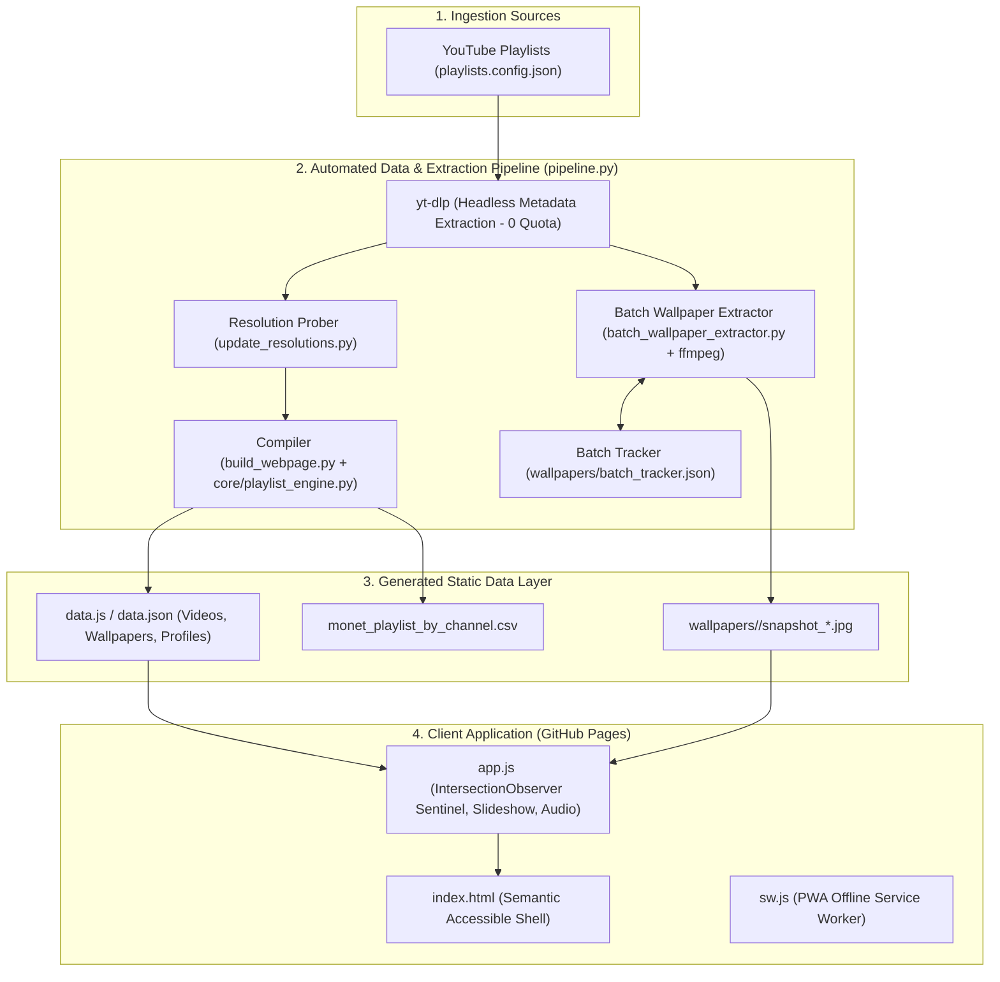

# 🎨 L'Impressionnisme Vivant
### *The Impressionist Video Explorer & 4K Wallpaper Archive*

[](https://lgtkgtv.github.io/monet-living-gallery/)
[](https://lgtkgtv.github.io/monet-living-gallery/)
[](https://lgtkgtv.github.io/monet-living-gallery/)
[](https://lgtkgtv.github.io/monet-living-gallery/)
[](https://lgtkgtv.github.io/monet-living-gallery/)
[](https://github.com/lgtkgtv/monet-living-gallery)
[](https://github.com/lgtkgtv/monet-living-gallery)

An interactive, curated digital museum and ultra-high-definition visual archive celebrating **Claude Monet** and the **Impressionist art movement**. 

Derived from curated YouTube collections (beginning with [sh_Monet inspired Visual Arts](https://www.youtube.com/playlist?list=PLeqGkucOU6lA)), the gallery catalogs **220 masterworks** across **41 distinct artistic channels**, delivering high-definition video curation, an extensive high-resolution wallpaper archive (100% of 4K titles + growing 1080p FHD backfill), fullscreen cinematic Ken Burns slideshow motion, atmospheric classical audio, and seamless cross-device collection sharing.

🌐 **Live Web Application**: **[https://lgtkgtv.github.io/monet-living-gallery/](https://lgtkgtv.github.io/monet-living-gallery/)**

---

## 🧭 Navigation & Overview

- [👤 User's Perspective (Visitor & Art Lover's Guide)](#-users-perspective-visitor--art-lovers-guide)
  - [1. 🎨 The Living Gallery & 4K UHD Masterworks](#1--the-living-gallery--4k-uhd-masterworks)
  - [2. 🔍 Guided Exploration & Channel Profiles](#2--guided-exploration--channel-profiles)
  - [3. 🖼️ Ken Burns Wallpaper Slideshow & Ambient Music](#3-️-ken-burns-wallpaper-slideshow--ambient-music)
  - [4. 💾 Instant Bulk Downloads & Adaptive Wallpapers](#4--instant-bulk-downloads--adaptive-wallpapers)
  - [5. ❤️ Saved Collections & Cross-Device Sharing](#5-️-saved-collections--cross-device-sharing)
  - [6. ⚖️ Ethical Attribution & Copyright Transparency](#6-️-ethical-attribution--copyright-transparency)
- [💻 Developer's Perspective (Architecture & Engineering Guide)](#-developers-perspective-architecture--engineering-guide)
  - [1. 🏛️ Core Architecture & Data Pipeline](#1-️-core-architecture--data-pipeline)
  - [2. 📚 Generic Multi-Playlist Engine (`core/`)](#2--generic-multi-playlist-engine-core)
  - [3. 🖼️ Headless Wallpaper Extraction & Anti-Throttling Engine](#3-️-headless-wallpaper-extraction--anti-throttling-engine)
  - [4. 🤖 GitHub Actions Workflow Dispatch & Automation](#4--github-actions-workflow-dispatch--automation)
  - [5. ⚡ Client-Side Performance & DOM Virtualization](#5--client-side-performance--dom-virtualization)
  - [6. 🧪 Test Suite & Quality Verification](#6--test-suite--quality-verification)
  - [7. 🛠️ Unified Pipeline CLI Reference (`pipeline.py`)](#7-️-unified-pipeline-cli-reference-pipelinepy)
- [📁 Repository Structure](#-repository-structure)
- [📜 License & Curator Credits](#-license--curator-credits)

---

## 👤 User's Perspective (Visitor & Art Lover's Guide)

Whether you are seeking quiet study accompaniment, high-resolution desktop backgrounds, or an art history exploration, *L'Impressionnisme Vivant* is crafted as a contemplative, museum-grade experience.

```
+---------------------------------------------------------------------------------------------------+
|  🎨 L'Impressionnisme Vivant — The Impressionist Living Gallery                                    |
|                                                                                                   |
|  [👑 Native 4K UHD (Default)]  [💎 1080p FHD]  [All Resolutions]  [📚 Playlist Filter]            |
|  [Artist Chips: Monet | Renoir | Sisley...]   [Theme Chips: Water Lilies | Giverny | Snow...]     |
+---------------------------------------------------------------------------------------------------+
|  [ 🎬 Video Masterworks Tab ]    [ 🖼️ Wallpaper Archive Tab ]    [ 🏛️ Channel Guides Tab ]        |
|                                                                                                   |
|  +--------------------+  +--------------------+  +--------------------+  +---------------------+  |
|  |  [4K UHD Badge]    |  |  [4K UHD Badge]    |  |  [FHD Badge]       |  |  [4K UHD Badge]     |  |
|  |  Water Lilies 1916 |  |  Woman with Parasol|  |  Autumn on Seine   |  |  Gare Saint-Lazare  |  |
|  |  ▶ Play  🖼️ Stills |  |  ▶ Play  🖼️ Stills |  |  ▶ Play  🖼️ Stills |  |  ▶ Play  🖼️ Stills  |  |
|  +--------------------+  +--------------------+  +--------------------+  +---------------------+  |
+---------------------------------------------------------------------------------------------------+
```

### 1. 🎨 The Living Gallery & 4K UHD Masterworks
- **Default Native 4K Experience**: The gallery defaults to filtering by **Native 4K UHD (3840×2160)**, instantly presenting 47 museum-grade living canvases where individual impasto brushstrokes and canvas textures are rendered with cinematic fidelity.
- **Midnight Gallery Dark Theme**: The interface defaults to an immersive deep midnight slate palette (`#0a0e14`) paired with authentic French cursive calligraphy headings. Canvases illuminate the screen without glare or visual distractions. A 1-click toggle switches to **Classic Museum Parchment** mode if preferred.

### 2. 🔍 Guided Exploration & Channel Profiles
- **Curated Search Chips**: Single-tap chips for legendary painters (*Claude Monet*, *Pierre-Auguste Renoir*, *Alfred Sisley*, *Eugène Boudin*, *Isaac Levitan*) and iconic Impressionist motifs (*Water Lilies*, *Garden Sanctuaries*, *Winter & Snow*, *Venice & Seine*, *Paris Belle Époque*) with real-time matching work counts.
- **Dedicated Channel Guides Tab**: Jump between the gallery and the **🏛️ Channel Guides** tab to explore detailed aesthetic profiles for 41 curating channels (*LearnFromMasters*, *Extraordinary Visual Art*, *Muse Visual Art*, *Painters Dream*, *Cupid Studio*, *Beautiful Living Art*, etc.), detailing their visual style, musical tone, and curatorial focus.

### 3. 🖼️ Ken Burns Wallpaper Slideshow & Ambient Music
- **Cinematic Ken Burns Motion**: When entering the fullscreen slideshow, high-resolution masterworks come alive with gentle, slow-panning and subtle zooming transitions, simulating an intimate gallery stroll.
- **Ambient Classical Soundtrack**: Curated background suites by Claude Debussy (*Clair de Lune*, *Première Arabesque*), Erik Satie (*Gymnopédie No. 1*), and Maurice Ravel (*Pavane pour une infante défunte*).
- **Strict Audio Isolation**: Clicking play on any YouTube video automatically mutes/pauses the ambient audio track, ensuring you hear the original video’s authentic audio design without overlapping noise.
- **Keyboard Shortcuts**:
  - `Space`: Pause / Resume Slideshow
  - `ArrowLeft` / `ArrowRight`: Previous / Next Wallpaper
  - `A`: Toggle Ambient Classical Music (Mute / Unmute)
  - `N`: Skip to Next Audio Track
  - `D`: Toggle Display Mode (Fit Entire Canvas vs Fill Screen)
  - `Esc`: Exit Fullscreen Slideshow

### 4. 💾 Instant Bulk Downloads & Adaptive Wallpapers
- **Adaptive Form Factors**: Snapshots are automatically categorized into **Desktop Widescreen (16:9)** and **Mobile Portrait** formats.
- **Client-Side Bulk ZIP**: Filter wallpapers by artist, channel, or resolution and download them in a single `.zip` file generated right in your browser via `JSZip`—no wait time, no server uploads.

### 5. ❤️ Saved Collections & Cross-Device Sharing
- **Private Bookmarking**: Tap the heart icon on any work or wallpaper to curate your private favorites list, saved locally in your browser (`localStorage`).
- **Seamless Cross-Device Sync**: Share your curated collection between your phone, laptop, or tablet using one-click JSON export/import or shareable URL links.

### 6. ⚖️ Ethical Attribution & Copyright Transparency
- **Per-Channel Copyright Badges**: Every video card and wallpaper lightbox prominently links back to the originating YouTube creator and channel.
- **Protected Content Respect**: Channels that request copyright protection are tagged as `Copyright Reserved (View-Only)`, and bulk wallpaper downloads are respectfully disabled for those works while keeping the living video experience accessible.
- **Curator Contact**: Direct reach-out to curator Sachin (`lgtkgtv@gmail.com`).

---

## 💻 Developer's Perspective (Architecture & Engineering Guide)

*L'Impressionnisme Vivant* is engineered as a zero-maintenance, zero-API-cost static site with an automated Python metadata & frame-extraction pipeline and a robust client-side rendering engine.

### 1. 🏛️ Core Architecture & Data Pipeline



### 2. 📚 Generic Multi-Playlist Engine (`core/`)
The architecture has been decoupled from single-playlist hardcoding into a reusable engine capable of ingesting arbitrary YouTube playlists:

- **`playlists.config.json`**:
  ```json
  [
    {
      "id": "PLeqGkucOU6lA",
      "title": "sh_Monet inspired Visual Arts",
      "url": "https://www.youtube.com/playlist?list=PLeqGkucOU6lA",
      "category": "Impressionism & Claude Monet",
      "enabled": true
    }
  ]
  ```
- **`core/playlist_engine.py`**:
  - Validates playlist URLs and IDs.
  - Normalizes catalog entries, tracking which playlist(s) each video originates from (`sourcePlaylistIds`).
  - Merges video records and deduplicates cross-listed works.
  - Dynamically injects playlist metadata into `data.js` and activates the `#playlistSelect` filter in the web UI when multiple playlists are registered.

### 3. 🖼️ Headless Wallpaper Extraction & Anti-Throttling Engine
Wallpaper scenes are extracted directly from video streams without consuming YouTube Data API quota:
- **Zero API Quota**: Uses `yt-dlp` to obtain direct CDN stream URLs and `ffmpeg` to extract uncompressed intra-frame stills.
- **Intelligent Scenery Sampling**: Timestamp calculation dynamically adapts to video length:
  - Short (<4 min): 7 scenes
  - Medium (4–15 min): 9 scenes
  - Long (15–60 min): 12 scenes
  - Anthologies (>60 min): 16 scenes
- **Luminosity Margin Sampling (`detect_form_factor`)**: Automatically categorizes stills as `desktop` widescreen (16:9) or `mobile` portrait by inspecting boundary luminosity for black letterboxing/pillarboxing bars.
- **Anti-Throttling Pacing**: Configurable request delay with randomized jitter (`delay + uniform(0.5, 2.0)`) prevents HTTP 429 rate limiting.
- **Stateful Resumption**: `wallpapers/batch_tracker.json` records status per video (`completed`, `in_progress`, `pending`, `failed`) allowing interruption-tolerant multi-day extractions.

### 4. 🤖 GitHub Actions Workflow Dispatch & Automation
The repository includes automated CI/CD workflows under `.github/workflows/`:
- **`sync.yml`**: Full-featured workflow supporting both automated weekly runs and manual on-demand execution (`workflow_dispatch`):
  ```yaml
  on:
    schedule:
      - cron: '0 4 * * 0'   # Weekly at 04:00 UTC
    workflow_dispatch:
      inputs:
        action:
          description: 'Sync Action to execute'
          required: true
          default: 'sync'
          type: choice
          options: [sync, pull, resolutions, extract, build]
        batch_size:
          description: 'Wallpaper extraction batch size'
          required: false
          default: '10'
        quality_tier:
          description: 'Resolution tier filter'
          required: false
          default: 'fhd'
          type: choice
          options: [all, 4k, fhd]
  ```
- Installs `ffmpeg` and `yt-dlp`, executes the pipeline, and commits updated datasets and extracted wallpapers back to `main`.

### 5. ⚡ Client-Side Performance & DOM Virtualization
- **Fast Initial Paint**: Initial render creates only 24 video cards via `DocumentFragment`.
- **`IntersectionObserver` Sentinel**: Seamlessly loads subsequent 24-card increments as the user scrolls within 400px of the page bottom, maintaining 60 FPS even across hundreds of items.
- **Focus Trapping & Accessibility**: Full WCAG compliance with keyboard trap utilities (`trapModalFocus`, `restoreFocus`), screen-reader live announcements (`aria-live="polite"`), and clear focus rings.
- **PWA Service Worker (`sw.js`)**: Cache-First strategy for images, CSS, and audio; Network-First with offline fallback for application data.

### 6. 🧪 Test Suite & Quality Verification
The project includes an end-to-end integration test suite in [`tests/test_gallery.js`](tests/test_gallery.js) executing against a simulated DOM environment:

```bash
node tests/test_gallery.js
```

**20 Verified Test Cases**:
1. Video card rendering & DOM batch threshold (>=24 cards)
2. Results counter formatting
3. Wallpaper grid tab switching
4. Saved favorites empty state
5. Channel guides tab navigation (toggle & return)
6. Channel card filter triggers
7. Video modal open/close lifecycle
8. Wallpaper modal open/close lifecycle
9. Legal modal open/close lifecycle
10. Simplified curator contact formatting
11. Search filtering accuracy
12. **Strict audio isolation** (ambient classical paused while video player active)
13. Corrupted `localStorage` ID auto-purge
14. Favorite addition and persistence
15. Favorite tab rendering of saved items
16. Favorite clear all and state reset
17. Channel copyright download prohibition enforcement
18. Default 4K resolution filter verification
19. Action bar visibility toggling
20. Cross-device collection sharing import/export

### 7. 🛠️ Unified Pipeline CLI Reference (`pipeline.py`)

```bash
# Display comprehensive archive telemetry (videos, 4K count, channels, wallpapers)
python3 pipeline.py --status

# Recompile data.js, data.json, and CSV catalog from current metadata
python3 pipeline.py --build

# Pull latest playlist updates directly from YouTube (multi-playlist enabled)
python3 pipeline.py --pull-playlist

# Audit and probe native resolutions for newly added titles
python3 pipeline.py --sync-resolutions

# Extract wallpaper batch for 1080p FHD tier with rate-limit delay
python3 pipeline.py --extract --tier FHD --batch-size 10 --delay 2.0

# Complete end-to-end sync (resolutions -> extraction -> build -> report)
python3 pipeline.py --sync

# Launch local preview server
python3 pipeline.py --serve --port 8000
```

---

## 📁 Repository Structure

```
├── .github/
│   └── workflows/
│       ├── sync.yml                   # Manual workflow_dispatch & scheduled sync workflow
│       └── sync_playlist.yml          # Legacy automated sync workflow
├── core/
│   ├── __init__.py                    # Python package definition
│   └── playlist_engine.py             # Multi-playlist abstraction, validation & merging
├── index.html                         # Accessible responsive application shell
├── styles.css                         # Midnight palette, cursive typography & responsive rules
├── app.js                             # Client controller (progressive DOM, slideshow, audio, sharing)
├── pipeline.py                        # Unified command-line interface orchestrator
├── batch_wallpaper_extractor.py       # Rate-limited frame extraction & form factor classifier
├── build_webpage.py                   # Data compiler (data.js, data.json, CSV & Markdown catalogs)
├── playlists.config.json              # Multi-playlist configuration registry
├── playlists.json                     # Secondary playlist registry
├── playlist_raw.json                  # Raw YouTube playlist metadata dump
├── video_resolutions.json             # Native resolution cache (100% indexed)
├── data.js                            # Precompiled browser dataset (videos, profiles, wallpapers)
├── data.json                          # JSON representation of catalog
├── monet_playlist_by_channel.csv      # Formatted CSV catalog with resolutions
├── monet_playlist_catalog.md          # Formatted Markdown catalog
├── tests/
│   └── test_gallery.js                # 20-point automated integration test suite
├── jszip.min.js                       # Client-side zip packaging library
├── sw.js                              # PWA service worker with offline caching
├── manifest.json                      # PWA web app manifest
└── wallpapers/                        # Wallpaper image archive
    ├── batch_tracker.json             # Resumable extraction state tracker
    ├── metadata.json                  # Wallpaper dimensions, timestamps & form factor tags
    └── <videoId>/                     # Extracted scene stills (snapshot_1.jpg, ...)
```

---

## 📜 License & Curator Credits

- **Curation**: Curated with passion for art history by **Sachin G** ([lgtkgtv@gmail.com](mailto:lgtkgtv@gmail.com)).
- **Artwork & Imagery**: Masterworks depicted belong to the public domain (Claude Monet, Pierre-Auguste Renoir, Camille Pissarro, and contemporary Impressionists). Motion animations, sound design, and living interpretations are the creative property of the respective 41 source YouTube channels.
- **Code**: The gallery application, extraction pipeline, and multi-playlist engine are released under the [MIT License](LICENSE).
