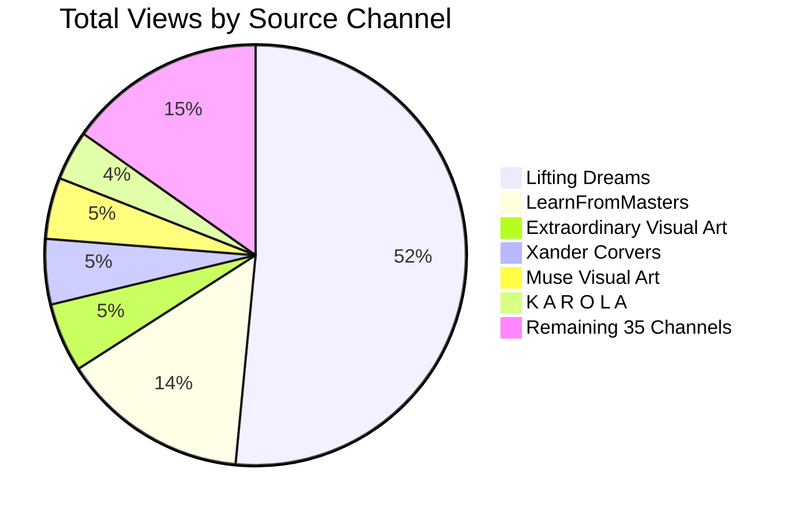

# YouTube Playlist Analysis: Claude Monet Inspired Visual Arts

**Playlist Link**: [sh_Monet inspired Visual Arts](https://www.youtube.com/playlist?list=PLeqGkucOU6lA)

---

## 1. Executive Summary & Overview Metrics

- **Total Videos**: 240
- **Total Cumulative Views**: 47,744,182
- **Total Runtime**: 88 hours, 8 minutes (317,337 seconds)
- **Average Video Duration**: 22m 2s
- **Unique Source Channels**: 44

### Key Observations & Insights
1. **Curator Specialization**: The playlist curates Impressionist visual arts—chiefly Claude Monet, but also related Impressionists and landscape masters (Eugene Boudin, Alfred Sisley, Isaac Levitan, Antonio Parreiras). The visual themes blend museum anthologies with modern AI living paintings, animated ambient art, and classical music pairings (Debussy, Satie, Chopin, Beethoven).
2. **The Backbone Channel (`Muse Visual Art`)**: **Muse Visual Art** provides **75 videos (37.1% of the entire playlist)**, focusing on 4K living art animations of Monet water lilies, Parisian gardens, and seasonal landscapes.
3. **Viewership Leader (`LearnFromMasters`)**: Despite having 15 videos (7.4% of total), **LearnFromMasters** generated **6,221,000 views (25.5% of total playlist views)**, featuring the single most popular video in the playlist: *Claude Monet: A collection of 1540 paintings (HD)* with **3,800,000 views**.
4. **Top 5 Channels by Views**: The top 5 channels by viewership (`LearnFromMasters`, `Lifting Dreams`, `Xander Corvers`, `Extraordinary Visual Art`, `Muse Visual Art`) account for **16,064,700 views (65.8% of total views)**.

---

## 2. Top 10 Most Popular Videos Overall

| Rank | Video Title | Source Channel | Views | Duration | Link |
|:---:|:---|:---|:---:|:---:|:---:|
| 1 | [Strauss ~ The Blue Danube Waltz](https://www.youtube.com/watch?v=cKkDMiGUbUw) | Lifting Dreams | 21,000,000 | 09:24 | [Watch](https://www.youtube.com/watch?v=cKkDMiGUbUw) |
| 2 | [Claude Monet: A collection of 1540 paintings (HD)](https://www.youtube.com/watch?v=nCVYEqc_Hw4) | LearnFromMasters | 3,800,000 | 2:08:22 | [Watch](https://www.youtube.com/watch?v=nCVYEqc_Hw4) |
| 3 | [Beautiful Paintings + Beautiful Classical Music](https://www.youtube.com/watch?v=8XdHP_fQoB0) | Lifting Dreams | 3,600,000 | 3:17:37 | [Watch](https://www.youtube.com/watch?v=8XdHP_fQoB0) |
| 4 | [Beethoven Moonlight Sonata - Piano Sonata No. 14 - 2 Hours Version](https://www.youtube.com/watch?v=yGKyyaETZ2M) | Xander Corvers | 2,400,000 | 2:01:51 | [Watch](https://www.youtube.com/watch?v=yGKyyaETZ2M) |
| 5 | [Antonio Parreiras (1860-1937) ✽ Brazilian painter](https://www.youtube.com/watch?v=TZUn8nU0CZI) | K A R O L A | 1,200,000 | 04:23 | [Watch](https://www.youtube.com/watch?v=TZUn8nU0CZI) |
| 6 | [Isaac Levitan: A collection of 437 paintings (HD)](https://www.youtube.com/watch?v=h3-WUZi-0hU) | LearnFromMasters | 927,000 | 44:16 | [Watch](https://www.youtube.com/watch?v=h3-WUZi-0hU) |
| 7 | [Visual Poems - Blooming - A Monet Reverie [AI Music Video]](https://www.youtube.com/watch?v=ziUJgYzKNI8) | Mystic Video AI | 870,000 | 10:58 | [Watch](https://www.youtube.com/watch?v=ziUJgYzKNI8) |
| 8 | [Visual Poems - Monet - Journey to the Water Lilies: A Day in the Garden - 4K](https://www.youtube.com/watch?v=MWRc13v-ZhA) | Extraordinary Visual Art | 842,000 | 08:05 | [Watch](https://www.youtube.com/watch?v=MWRc13v-ZhA) |
| 9 | [Visual Poems - Van Gogh Part I - Roots in Shadow [Art Music Video 4K]](https://www.youtube.com/watch?v=Sk8XKO668Ks) | Creators of Curiosity | 796,000 | 02:57 | [Watch](https://www.youtube.com/watch?v=Sk8XKO668Ks) |
| 10 | [Van Gogh comes to life](https://www.youtube.com/watch?v=guWuLB1eI8s) | MoltenArt | 608,000 | 00:15 | [Watch](https://www.youtube.com/watch?v=guWuLB1eI8s) |

---

## 3. Channel Breakdown Table (Sorted by Channel Popularity)

| # | Source Channel | Video Count | Total Views | Avg Views/Vid | Top Video Title | Top Video Views |
|:---:|:---|:---:|:---:|:---:|:---|:---:|
| 1 | [Lifting Dreams](https://www.youtube.com/channel/UCux51cdq0SlyEl29eYPpnkg) | 2 | 24,600,000 | 12,300,000 | [Strauss ~ The Blue Danube Waltz](https://www.youtube.com/watch?v=cKkDMiGUbUw) | 21,000,000 |
| 2 | [LearnFromMasters](https://www.youtube.com/channel/UCWjLl5TDZqMZimHbHXk0Wpg) | 17 | 6,870,000 | 404,118 | [Claude Monet: A collection of 1540 paintings (HD)](https://www.youtube.com/watch?v=nCVYEqc_Hw4) | 3,800,000 |
| 3 | [Extraordinary Visual Art](https://www.youtube.com/channel/UCB5QogHzrLP7VlG_f0rK8hQ) | 37 | 2,535,093 | 68,516 | [Visual Poems - Monet - Journey to the Water Lilies: A Day in the Garden - 4K](https://www.youtube.com/watch?v=MWRc13v-ZhA) | 842,000 |
| 4 | [Xander Corvers](https://www.youtube.com/channel/UCZUadM5QSnw9JWOy9nfVcGg) | 1 | 2,400,000 | 2,400,000 | [Beethoven Moonlight Sonata - Piano Sonata No. 14 - 2 Hours Version](https://www.youtube.com/watch?v=yGKyyaETZ2M) | 2,400,000 |
| 5 | [Muse Visual Art](https://www.youtube.com/channel/UC0OfM-PGrJgi_cSBwI0-nGg) | 82 | 2,252,800 | 27,473 | [Visual Poems - Woodland Walk by Floral Scent - Living Oil Paintings](https://www.youtube.com/watch?v=ZXjKmShmdUc) | 179,000 |
| 6 | [K A R O L A](https://www.youtube.com/channel/UCd67RarDaTRSpcZFW7O5fnQ) | 9 | 1,825,300 | 202,811 | [Antonio Parreiras (1860-1937) ✽ Brazilian painter](https://www.youtube.com/watch?v=TZUn8nU0CZI) | 1,200,000 |
| 7 | [Mystic Video AI](https://www.youtube.com/channel/UC0tpBPe3PVzy7Xj3qf9D0FA) | 3 | 1,257,000 | 419,000 | [Visual Poems - Blooming - A Monet Reverie [AI Music Video]](https://www.youtube.com/watch?v=ziUJgYzKNI8) | 870,000 |
| 8 | [Painters Dream](https://www.youtube.com/channel/UCqCzEEy42I36ACXVFs2t15g) | 18 | 972,500 | 54,028 | [Visual Poems - Claude Monet - Arrival of the Normandy Train ](https://www.youtube.com/watch?v=CBNoD-qbdss) | 365,000 |
| 9 | [Creators of Curiosity](https://www.youtube.com/channel/UCxguRubsIRpLodrMwVJFIqg) | 2 | 913,000 | 456,500 | [Visual Poems - Van Gogh Part I - Roots in Shadow [Art Music Video 4K]](https://www.youtube.com/watch?v=Sk8XKO668Ks) | 796,000 |
| 10 | [Famous Paintings For TV A Window Into The Museum](https://www.youtube.com/channel/UCeOcs9KHbcOZuibnR4xnMVg) | 3 | 840,000 | 280,000 | [Monet in pastels for spring time. Fine art screensaver with music, Gardens, seaside, cottage, summer](https://www.youtube.com/watch?v=FN16izlRi-8) | 517,000 |
| 11 | [MoltenArt](https://www.youtube.com/channel/UC4NOJfXaNo_LKo5qKbjNveQ) | 1 | 608,000 | 608,000 | [Van Gogh comes to life](https://www.youtube.com/watch?v=guWuLB1eI8s) | 608,000 |
| 12 | [Artful TV - Beautiful Wallpapers and Screensavers](https://www.youtube.com/channel/UC-L8sZPo_tF96-LE1ykvqsw) | 1 | 367,000 | 367,000 | [4K Claude Monet Screensaver - Monet Painting Wallpaper Slideshow - 3 Hours, No Music](https://www.youtube.com/watch?v=AWcmN1W_jJI) | 367,000 |
| 13 | [Paintings I Love](https://www.youtube.com/channel/UCSNkM642FT9v3tEfyE-rwTQ) | 1 | 324,000 | 324,000 | [Russian Painting – The Best of Russian Landscape Painters / Пейзажи знаменитых русских художников](https://www.youtube.com/watch?v=FTxh92VdZVw) | 324,000 |
| 14 | [Living Motion Paintings](https://www.youtube.com/channel/UCldFnZSd7OFcqIO1gcBSb4g) | 3 | 302,000 | 100,667 | [Ivan Shishkin: The Master of Russian Landscape Painting - 4K Slideshow with Relaxing Music](https://www.youtube.com/watch?v=40xg3sB2PEc) | 207,000 |
| 15 | [The Victorian Fantasy Canvas](https://www.youtube.com/channel/UCB0Nb0tyHuSAUuF1xC5vULw) | 1 | 275,000 | 275,000 | [A Victorian Train Journey to the English Countryside 🚂🌿 - English Visual Poem](https://www.youtube.com/watch?v=vY00F5WCS5o) | 275,000 |
| 16 | [Living Canvas Dreams](https://www.youtube.com/channel/UCfovQbYz7x30QlxhC-bI1Fw) | 2 | 267,000 | 133,500 | [Visual Poems - The Little Match Girl - A Gentel 1848 Copenhagen Winter Tale - Relaxing Classic Music](https://www.youtube.com/watch?v=qykGjhk80Sw) | 235,000 |
| 17 | [Mind Travel 마인드 트래블](https://www.youtube.com/channel/UCgfnBRJ7HBgmeVbPFMfnZRg) | 2 | 228,000 | 114,000 | [힐링명화감상 거실미술관 🎵빈센트 반 고흐 꽃그림과 편안한 음악🎵 Van Gogh Art Slideshow🌞Beautiful Paintings Relaxing Music](https://www.youtube.com/watch?v=CnaWoKQRCnI) | 165,000 |
| 18 | [Татьяна Ч.](https://www.youtube.com/channel/UChtnk1aaEC7Hszwy09JhIkA) | 1 | 187,000 | 187,000 | [Красиво о зиме. Живопись](https://www.youtube.com/watch?v=DwSmbvERJtk) | 187,000 |
| 19 | [Your Home Gallery](https://www.youtube.com/channel/UCAOLEd6iGanm00dzJrjk70A) | 1 | 144,000 | 144,000 | [CLAUDE MONET - 4K HD Vintage Art TV - MONET Famous Art Collection Slideshow - Screensaver w/ Detail](https://www.youtube.com/watch?v=yYmuEB9XTnY) | 144,000 |
| 20 | [Visual Poems in Paintings](https://www.youtube.com/channel/UCf9Lq9Y5ONa66jB31QTZSig) | 1 | 116,000 | 116,000 | [A Rainy Day in the English Countryside - Victorian Visual Poem with Classical Music](https://www.youtube.com/watch?v=ejXEYGBo2E0) | 116,000 |
| 21 | [ARTALE](https://www.youtube.com/channel/UCLwtn9oXaVgiFMmc7VuUJTg) | 1 | 91,000 | 91,000 | [One Gentle Night in an English Village 🌙 Cozy Countryside Life I Visual Poem](https://www.youtube.com/watch?v=tJjqAH1h8fk) | 91,000 |
| 22 | [Monet’s Living Dreams](https://www.youtube.com/channel/UCsZchtuhQCzuMm16vvpn4Ww) | 4 | 73,200 | 18,300 | [Visual Poems - Claude Monet - Living Inside a 19th-Century Impressionist Dream](https://www.youtube.com/watch?v=ONbcVsCVpxM) | 31,000 |
| 23 | [Art Revived](https://www.youtube.com/channel/UCTK4cCGXgHTnMCQqj-ZkuzQ) | 10 | 39,332 | 3,933 | [Claude Monet Impressionism Animation - A Summer in Belle Époque France - Relaxing Art](https://www.youtube.com/watch?v=VG1Z_CS8G3U) | 16,000 |
| 24 | [Rollo Paterson - The Last Impressionist](https://www.youtube.com/channel/UCvGk1qwSWEIsQzPiLc89e5w) | 2 | 38,000 | 19,000 | [Alexander Shevelev (1964) - A contemporary Russian painter, master of landscape and color.](https://www.youtube.com/watch?v=Bxr5GYtwRnY) | 20,000 |
| 25 | [LetsFallinArt](https://www.youtube.com/channel/UCUVxLeCbJSEtHKelsG6uQDQ) | 1 | 32,000 | 32,000 | [Ivan Aivazovsky - 50 of his Best Paintings](https://www.youtube.com/watch?v=A-le9yB8PYY) | 32,000 |
| 26 | [Маргарита Полянская](https://www.youtube.com/channel/UCbB-G6-8C6RXuGjrAOxrOpw) | 1 | 31,000 | 31,000 | [Художник Божков Роман Александрович](https://www.youtube.com/watch?v=26VEKoCFZcI) | 31,000 |
| 27 | [노르웨이 숲 Norwegian Wood](https://www.youtube.com/channel/UCLHYWdHibzsnW1M8ezRaxpQ) | 1 | 30,000 | 30,000 | [[𝙋𝙡𝙖𝙮𝙡𝙞𝙨𝙩] 모네의 여름 클래식 - 첫 소절만 들어도 알듯한 명곡 클래식](https://www.youtube.com/watch?v=uR1ljov-MRc) | 30,000 |
| 28 | [Oil Memory](https://www.youtube.com/channel/UCAtLgVLU8Vf5OrWBOMB2O0A) | 1 | 28,000 | 28,000 | [Back to Grimaud Village - With My Grandmother - Visual Poems - Relaxing Music](https://www.youtube.com/watch?v=ZGW5FS7vkEg) | 28,000 |
| 29 | [Art for us](https://www.youtube.com/channel/UCQAVzPC0BlalVDThyKzTFLA) | 1 | 22,000 | 22,000 | [Magnus Munsterhjelm/Магнус  Мунстеръелм](https://www.youtube.com/watch?v=xC3BeK35fPw) | 22,000 |
| 30 | [Faces of Ancient Europe](https://www.youtube.com/channel/UCXqfbPOyADaV_v38Gp4CiiA) | 1 | 16,000 | 16,000 | [Romantic Russian Paintings of Ships at Sea by Ivan Aivazovsky](https://www.youtube.com/watch?v=6fwRmi1dCwg) | 16,000 |
| 31 | [Visual Poems AI](https://www.youtube.com/channel/UC2tDAOcgjBKMqjIYqCPo-YA) | 1 | 14,000 | 14,000 | [Van Gogh Visual Poems – Full Journey I - The Sky That Remembered Him](https://www.youtube.com/watch?v=U6aYJHR-XsQ) | 14,000 |
| 32 | [Living Visual Poems](https://www.youtube.com/channel/UC8OJx6hpApmEcPIa-AEwueQ) | 4 | 11,698 | 2,924 | [Visual Poems - Monet Blue Sea - Living Oil Painting](https://www.youtube.com/watch?v=55ZjmzmUoFc) | 4,200 |
| 33 | [Nocturne Canvas](https://www.youtube.com/channel/UCRf_tQc0cI0lJb0F848qxUQ) | 1 | 8,500 | 8,500 | [Stay a Moment Longer Where the Footbridge Has Watched Every Season Turn 🍂 - Relaxing Classical Music](https://www.youtube.com/watch?v=sdquibgE3dU) | 8,500 |
| 34 | [Beautiful Living Art](https://www.youtube.com/channel/UCRHwLLdlYo0WZbeuQ1slnNA) | 13 | 6,993 | 538 | [Visual Poems - Claude Monet - Enter a Renoir Painting - Warm Relaxing Monet Inspired Visual Poetry 3](https://www.youtube.com/watch?v=gj55gTwrllA) | 1,700 |
| 35 | [Visual Classic](https://www.youtube.com/channel/UCt4wEgd1ozlhkwy1iQ-9rlw) | 1 | 6,400 | 6,400 | [🌌 Visual Poems / Van Gogh Part I / Light Beneath the Night (Music Video)](https://www.youtube.com/watch?v=niIh8h8hAWo) | 6,400 |
| 36 | [Cozy Calm Canvas](https://www.youtube.com/channel/UCwsV_y9XG2NFZGIHZgq7fmw) | 1 | 3,300 | 3,300 | [Visual Poem -Monet-style Girl & Nature🎨✨](https://www.youtube.com/watch?v=-UAZ9tHEU14) | 3,300 |
| 37 | [Luminaris Muse](https://www.youtube.com/channel/UCGxfAYU8ya7H15nZMLIsydw) | 1 | 3,300 | 3,300 | [Visual Poems - Monet - Whisper of Light [Soothing & Healing Art]](https://www.youtube.com/watch?v=j5EPNKdBb4Q) | 3,300 |
| 38 | [Velora Classical](https://www.youtube.com/channel/UCAzT1Jf_MAIVPVMj0yVq9EA) | 1 | 2,600 | 2,600 | [Gentle Chopin: Beautiful Piano Pieces Soothe the Soul - A Calm Night of Classical Music](https://www.youtube.com/watch?v=81njIoQoAOQ) | 2,600 |
| 39 | [VISUALIAPRO](https://www.youtube.com/channel/UCEq1Wp2cGAYmD-XKmDoSQwg) | 1 | 2,100 | 2,100 | [Monet: The Last Colors of Memory - A Visual Poem by Visualiapro [AI Art Film 4K]](https://www.youtube.com/watch?v=wMEFlcQcn3I) | 2,100 |
| 40 | [Mellostring](https://www.youtube.com/channel/UCShfhQGVL-gmEcw_t-iEGRQ) | 1 | 772 | 772 | [[𝗽𝗹𝗮𝘆𝗹𝗶𝘀𝘁] A Lazy Stroll in a Green Garden 🍃 Classical Melodies for Pleasant Focus Mellostring](https://www.youtube.com/watch?v=mU3u9f43XVg) | 772 |
| 41 | [Slow Frame](https://www.youtube.com/channel/UCl-7VK_DVk6eDravqXpJw7Q) | 1 | 196 | 196 | [The Frame Art TV 4K - Lone Tree - Oil Painting Style - Soft Music](https://www.youtube.com/watch?v=OPKpzQXzHds) | 196 |
| 42 | [Leila | visual poems](https://www.youtube.com/channel/UC-SWu32X6JxMga9CrTooTLA) | 1 | 82 | 82 | [Visual Poetry -  Art History & Technology- Levitan](https://www.youtube.com/watch?v=cNVsdKLsCDM) | 82 |
| 43 | [Theartnoi](https://www.youtube.com/channel/UCJKIyxLR54vvRKRxybuWBvw) | 1 | 16 | 16 | [Van Gogh - Original Paintings](https://www.youtube.com/watch?v=_KdWYOjfmgg) | 16 |
| 44 | [Living Art Moments](https://www.youtube.com/channel/UCHtLDe6VMCvYO3C8-VjZWaw) | 1 | 0 | 0 | [Visual Poems - Monet Style Living Art - with my cat](https://www.youtube.com/watch?v=lz0wa2hDis0) | 0 |

---

## 4. Complete Playlist Arranged by Channel & Popularity

> Channels are ordered by total channel popularity. Inside each channel, every video is arranged in descending order of views.

### 1. [Lifting Dreams](https://www.youtube.com/channel/UCux51cdq0SlyEl29eYPpnkg)
- **Videos in Playlist**: 2 | **Total Views**: 24,600,000 | **Average Views**: 12,300,000

| Rank | Video Title | Views | Duration | Link |
|:---:|:---|:---:|:---:|:---:|
| 1 | [Strauss ~ The Blue Danube Waltz](https://www.youtube.com/watch?v=cKkDMiGUbUw) | 21,000,000 | 09:24 | [Watch](https://www.youtube.com/watch?v=cKkDMiGUbUw) |
| 2 | [Beautiful Paintings + Beautiful Classical Music](https://www.youtube.com/watch?v=8XdHP_fQoB0) | 3,600,000 | 3:17:37 | [Watch](https://www.youtube.com/watch?v=8XdHP_fQoB0) |

### 2. [LearnFromMasters](https://www.youtube.com/channel/UCWjLl5TDZqMZimHbHXk0Wpg)
- **Videos in Playlist**: 17 | **Total Views**: 6,870,000 | **Average Views**: 404,118

| Rank | Video Title | Views | Duration | Link |
|:---:|:---|:---:|:---:|:---:|
| 1 | [Claude Monet: A collection of 1540 paintings (HD)](https://www.youtube.com/watch?v=nCVYEqc_Hw4) | 3,800,000 | 2:08:22 | [Watch](https://www.youtube.com/watch?v=nCVYEqc_Hw4) |
| 2 | [Isaac Levitan: A collection of 437 paintings (HD)](https://www.youtube.com/watch?v=h3-WUZi-0hU) | 927,000 | 44:16 | [Watch](https://www.youtube.com/watch?v=h3-WUZi-0hU) |
| 3 | [Peder Mørk Mønsted: A collection of 284 paintings (HD)](https://www.youtube.com/watch?v=52Sg9uFRx4s) | 410,000 | 28:51 | [Watch](https://www.youtube.com/watch?v=52Sg9uFRx4s) |
| 4 | [Eugene Boudin: A collection of 1163 works (HD)](https://www.youtube.com/watch?v=gAWrEV-3ahw) | 407,000 | 1:56:46 | [Watch](https://www.youtube.com/watch?v=gAWrEV-3ahw) |
| 5 | [Alfred Sisley: A collection of 419 works (HD)](https://www.youtube.com/watch?v=49gUho777mI) | 293,000 | 42:22 | [Watch](https://www.youtube.com/watch?v=49gUho777mI) |
| 6 | [Fritz Thaulow: A collection of 178 works (HD) *UPDATE](https://www.youtube.com/watch?v=XUEzojRuVhw) | 233,000 | 18:21 | [Watch](https://www.youtube.com/watch?v=XUEzojRuVhw) |
| 7 | [Guglielmo Ciardi: A collection of 54 paintings (HD)](https://www.youtube.com/watch?v=Xul5WT0ReYw) | 158,000 | 05:56 | [Watch](https://www.youtube.com/watch?v=Xul5WT0ReYw) |
| 8 | [Gustave Loiseau: A collection of 564 works (HD)](https://www.youtube.com/watch?v=8tt3XV_OIlc) | 152,000 | 56:53 | [Watch](https://www.youtube.com/watch?v=8tt3XV_OIlc) |
| 9 | [Johan Hendrik Weissenbruch: A collection of 92 paintings (HD)](https://www.youtube.com/watch?v=jVQ_mmOomvY) | 71,000 | 09:38 | [Watch](https://www.youtube.com/watch?v=jVQ_mmOomvY) |
| 10 | [Vladimir Orlovsky: A collection of 60 paintings (HD)](https://www.youtube.com/watch?v=MyM-rQ5ZvGk) | 71,000 | 06:33 | [Watch](https://www.youtube.com/watch?v=MyM-rQ5ZvGk) |
| 11 | [Charles Leickert: A collection of 116 paintings (HD)](https://www.youtube.com/watch?v=6rfKrNplN04) | 67,000 | 12:02 | [Watch](https://www.youtube.com/watch?v=6rfKrNplN04) |
| 12 | [Anders Askevold: A collection of 73 paintings (HD)](https://www.youtube.com/watch?v=_OSQz1PzQn8) | 65,000 | 07:44 | [Watch](https://www.youtube.com/watch?v=_OSQz1PzQn8) |
| 13 | [Gao Xingjian: A collection of 50 works (HD)](https://www.youtube.com/watch?v=8z5XHjZwaEU) | 59,000 | 05:33 | [Watch](https://www.youtube.com/watch?v=8z5XHjZwaEU) |
| 14 | [Eugen Bracht: A collection of 44 paintings (HD)](https://www.youtube.com/watch?v=Xbfis3bqJ7M) | 52,000 | 04:56 | [Watch](https://www.youtube.com/watch?v=Xbfis3bqJ7M) |
| 15 | [Theodore Rousseau: A collection of 118 paintings (HD)](https://www.youtube.com/watch?v=y_V8_qF9i-s) | 51,000 | 12:14 | [Watch](https://www.youtube.com/watch?v=y_V8_qF9i-s) |
| 16 | [Nils Kreuger: A collection of 85 paintings (HD)](https://www.youtube.com/watch?v=S2diglp47fo) | 32,000 | 09:02 | [Watch](https://www.youtube.com/watch?v=S2diglp47fo) |
| 17 | [Rose Maynard Barton: A collection of 40 paintings (HD)](https://www.youtube.com/watch?v=Ht3cSOCueJc) | 22,000 | 04:32 | [Watch](https://www.youtube.com/watch?v=Ht3cSOCueJc) |

### 3. [Extraordinary Visual Art](https://www.youtube.com/channel/UCB5QogHzrLP7VlG_f0rK8hQ)
- **Videos in Playlist**: 37 | **Total Views**: 2,535,093 | **Average Views**: 68,516

| Rank | Video Title | Views | Duration | Link |
|:---:|:---|:---:|:---:|:---:|
| 1 | [Visual Poems - Monet - Journey to the Water Lilies: A Day in the Garden - 4K](https://www.youtube.com/watch?v=MWRc13v-ZhA) | 842,000 | 08:05 | [Watch](https://www.youtube.com/watch?v=MWRc13v-ZhA) |
| 2 | [Visual Poem - Claude Monet - Living Inside Monet's "Woman with a Parasol" - 4K](https://www.youtube.com/watch?v=RX0kyBl-4Bk) | 442,000 | 02:47 | [Watch](https://www.youtube.com/watch?v=RX0kyBl-4Bk) |
| 3 | [Visual Poems - Claude Monet - A Nostalgic Winter Journey by Steam Train - 4K](https://www.youtube.com/watch?v=x3fwY0Kh7uM) | 212,000 | 03:03 | [Watch](https://www.youtube.com/watch?v=x3fwY0Kh7uM) |
| 4 | [Visual Poems - Renoir - Stepping into the World of "Gathering Flowers"](https://www.youtube.com/watch?v=fjT4VO79B5U) | 175,000 | 04:17 | [Watch](https://www.youtube.com/watch?v=fjT4VO79B5U) |
| 5 | [Visual Poems - Leonardo da Vinci - *Mona Lisa*: Why did she smile in Florence in 1503?](https://www.youtube.com/watch?v=HyQ0NlCc6do) | 145,000 | 04:03 | [Watch](https://www.youtube.com/watch?v=HyQ0NlCc6do) |
| 6 | [Visual Poems - Claude Monet - She Steps into 'Gare Saint-Lazare' - 4K](https://www.youtube.com/watch?v=H5pyEf4NL_E) | 138,000 | 03:14 | [Watch](https://www.youtube.com/watch?v=H5pyEf4NL_E) |
| 7 | [Visual Poem - Vermeer "Girl with a Pearl Earring": The Awakening of Light & Eternal Gaze - 4K](https://www.youtube.com/watch?v=2hjGcBOCkfk) | 98,000 | 03:51 | [Watch](https://www.youtube.com/watch?v=2hjGcBOCkfk) |
| 8 | [Visual Poems - Claude Monet - Living Inside Monet's "Impression, Sunrise" (4K Visual Story)](https://www.youtube.com/watch?v=RDhj8mOWXsg) | 80,000 | 02:54 | [Watch](https://www.youtube.com/watch?v=RDhj8mOWXsg) |
| 9 | [Visual Poems - Claude Monet - "Whispers of the River Epte": Flowing Light and a Green Healing Dream](https://www.youtube.com/watch?v=AubPDZQPVEY) | 70,000 | 04:50 | [Watch](https://www.youtube.com/watch?v=AubPDZQPVEY) |
| 10 | [Visual Poems - Claude Monet - Living Inside "The Water Lily Pond" (4K Visual Story)](https://www.youtube.com/watch?v=Kv8qx-XkxJc) | 60,000 | 03:03 | [Watch](https://www.youtube.com/watch?v=Kv8qx-XkxJc) |
| 11 | [Visual Poems - Claude Monet "The Cliffs at Étretat": Storm, Reflection & Golden Sunset - 4K](https://www.youtube.com/watch?v=y0NG1iXxuhY) | 44,000 | 09:44 | [Watch](https://www.youtube.com/watch?v=y0NG1iXxuhY) |
| 12 | [Visual Poem - Winter Silence in Normandy - Inspired by Monet's "The Magpie"](https://www.youtube.com/watch?v=zA3_D2o5lgc) | 28,000 | 04:19 | [Watch](https://www.youtube.com/watch?v=zA3_D2o5lgc) |
| 13 | [Visual Poems - Monet - Poetic Muse in the Poppy Sea: Red Romance in the Breeze [4K Pure Cinematic]](https://www.youtube.com/watch?v=7TPQifuITmM) | 18,000 | 08:17 | [Watch](https://www.youtube.com/watch?v=7TPQifuITmM) |
| 14 | [Visual Poems - Claude Monet - "Golden Dreams of the Riviera": An 8-Minute Immersive Journey - 4K](https://www.youtube.com/watch?v=XhnGd0MNRrI) | 17,000 | 08:04 | [Watch](https://www.youtube.com/watch?v=XhnGd0MNRrI) |
| 15 | [Visual Poems - Monet's Haystacks: Capturing Fleeting Light & Eternity - 4K Immersive](https://www.youtube.com/watch?v=ltdyuf1oK6I) | 17,000 | 04:07 | [Watch](https://www.youtube.com/watch?v=ltdyuf1oK6I) |
| 16 | [Visual Poems - Claude Monet - The Grand Canal: An Emerald Dream on Water - 4K](https://www.youtube.com/watch?v=NKK6mP47EFE) | 16,000 | 04:20 | [Watch](https://www.youtube.com/watch?v=NKK6mP47EFE) |
| 17 | [Visual Poem - Claude Monet - "Train to Spring": An 8-Minute Journey Through 19th Century Europe - 4K](https://www.youtube.com/watch?v=eDjSipbx9HA) | 16,000 | 08:45 | [Watch](https://www.youtube.com/watch?v=eDjSipbx9HA) |
| 18 | [Visual Poems - Claude Monet - Garden at Sainte-Adresse: The Golden Afternoon & Eternal Gaze - 4K](https://www.youtube.com/watch?v=4oyXZY4Bs4Q) | 15,000 | 10:33 | [Watch](https://www.youtube.com/watch?v=4oyXZY4Bs4Q) |
| 19 | [Visual Poems - Monet - City Market: Old Bookstalls and Coffee Aroma Along the Seine in Paris -4K](https://www.youtube.com/watch?v=EHgDWy0a3Is) | 13,000 | 08:41 | [Watch](https://www.youtube.com/watch?v=EHgDWy0a3Is) |
| 20 | [Visual Poems - Vincent van Gogh - The Night Café: A Hallucination of Four Vincents - 4K](https://www.youtube.com/watch?v=uLtTuYGEO_E) | 11,000 | 03:03 | [Watch](https://www.youtube.com/watch?v=uLtTuYGEO_E) |
| 21 | [Monet’s River of Light: The Poplars on the Epte｜Impressionist Art Film](https://www.youtube.com/watch?v=eIBHyqwf_IU) | 8,900 | 04:28 | [Watch](https://www.youtube.com/watch?v=eIBHyqwf_IU) |
| 22 | [Visual Feast - Claude Monet - "Windmills of Zaandam": An 8-Minute Journey Through Dutch Tulip Fields](https://www.youtube.com/watch?v=KKkGsQkfBjw) | 8,400 | 08:39 | [Watch](https://www.youtube.com/watch?v=KKkGsQkfBjw) |
| 23 | [Visual Poems - Monet - A Letter to the Sea: A Romantic Encounter with the Wind and Deep Blue - 4K](https://www.youtube.com/watch?v=65npkgKIiPY) | 8,200 | 08:15 | [Watch](https://www.youtube.com/watch?v=65npkgKIiPY) |
| 24 | [Monet - A Train Through the 19th-Century Silk Road｜Impressionist Oil Painting Art Film - 4K](https://www.youtube.com/watch?v=4Pf-Azm4TwA) | 7,100 | 12:12 | [Watch](https://www.youtube.com/watch?v=4Pf-Azm4TwA) |
| 25 | [Visual Poetry - When the Rain Leaves, Beauty Remains - Impressionist Art Film - 4K](https://www.youtube.com/watch?v=OCnLJCmckDQ) | 5,800 | 03:42 | [Watch](https://www.youtube.com/watch?v=OCnLJCmckDQ) |
| 26 | [Visual Poem - Johanna Spyri - "Heidi": The Breath of the Alps and the Healing of the Soul - 4K](https://www.youtube.com/watch?v=tQw4aLeY5Oo) | 5,800 | 04:51 | [Watch](https://www.youtube.com/watch?v=tQw4aLeY5Oo) |
| 27 | [Visual Poetry - A Train to Another Time - Impressionist Art Film - 4K](https://www.youtube.com/watch?v=Rxtp7exVHQU) | 5,100 | 04:21 | [Watch](https://www.youtube.com/watch?v=Rxtp7exVHQU) |
| 28 | [Visual Poems - Claude Monet - "American West: Red Rocks & Sunsets" - 4K](https://www.youtube.com/watch?v=OBrDPcnXEC4) | 4,600 | 08:15 | [Watch](https://www.youtube.com/watch?v=OBrDPcnXEC4) |
| 29 | [Visual Poem - Monet - Country Wedding: Long Table Banquet & Cheerful Dance Under Apple Blossoms - 4K](https://www.youtube.com/watch?v=y5Ndomujfa0) | 4,300 | 09:08 | [Watch](https://www.youtube.com/watch?v=y5Ndomujfa0) |
| 30 | [Monet’s Four Seasons: A Journey Through Light and Time - Impressionist Art Film - 4K](https://www.youtube.com/watch?v=dnH4wrB4-Gk) | 4,200 | 03:16 | [Watch](https://www.youtube.com/watch?v=dnH4wrB4-Gk) |
| 31 | [Visual Poems - Monet - Lakeside Studio: Painter Sketching by the Shimmering Lake](https://www.youtube.com/watch?v=rNebBr9SVBQ) | 3,200 | 04:29 | [Watch](https://www.youtube.com/watch?v=rNebBr9SVBQ) |
| 32 | [Visual Poems - Van Gogh - What If Van Gogh Painted Along the River During the Qingming Festival?](https://www.youtube.com/watch?v=fNeoeo7RSXk) | 2,700 | 08:04 | [Watch](https://www.youtube.com/watch?v=fNeoeo7RSXk) |
| 33 | [Visual Poetry - An Afternoon Lost in Lavender - Impressionist Art Film - 4K](https://www.youtube.com/watch?v=u5KOrhx6mvY) | 2,500 | 04:10 | [Watch](https://www.youtube.com/watch?v=u5KOrhx6mvY) |
| 34 | [Visual Poems - Van Gogh - Modern Metropolis: Neon Forest and Wild Strokes Under the Starry Night -4K](https://www.youtube.com/watch?v=9JUvonz0-5s) | 2,400 | 08:06 | [Watch](https://www.youtube.com/watch?v=9JUvonz0-5s) |
| 35 | [Visual Poems - Monet - Returning Home: Warmth of Years and a Knowing Smile in the Autumn Manor [4K]](https://www.youtube.com/watch?v=4ER-KQjaE7U) | 2,400 | 05:21 | [Watch](https://www.youtube.com/watch?v=4ER-KQjaE7U) |
| 36 | [Visual Poems - Monet - Steam Age: Velvet Seats on the Orient Express & European Plains](https://www.youtube.com/watch?v=b90lVuK3Hpc) | 1,900 | 06:22 | [Watch](https://www.youtube.com/watch?v=b90lVuK3Hpc) |
| 37 | [Visual Poetry - Visual Poetry - A Balloon Journey Through the Valley - Impressionist Art Film - 4K](https://www.youtube.com/watch?v=485t9ogWpm8) | 593 | 04:28 | [Watch](https://www.youtube.com/watch?v=485t9ogWpm8) |

### 4. [Xander Corvers](https://www.youtube.com/channel/UCZUadM5QSnw9JWOy9nfVcGg)
- **Videos in Playlist**: 1 | **Total Views**: 2,400,000 | **Average Views**: 2,400,000

| Rank | Video Title | Views | Duration | Link |
|:---:|:---|:---:|:---:|:---:|
| 1 | [Beethoven Moonlight Sonata - Piano Sonata No. 14 - 2 Hours Version](https://www.youtube.com/watch?v=yGKyyaETZ2M) | 2,400,000 | 2:01:51 | [Watch](https://www.youtube.com/watch?v=yGKyyaETZ2M) |

### 5. [Muse Visual Art](https://www.youtube.com/channel/UC0OfM-PGrJgi_cSBwI0-nGg)
- **Videos in Playlist**: 82 | **Total Views**: 2,252,800 | **Average Views**: 27,473

| Rank | Video Title | Views | Duration | Link |
|:---:|:---|:---:|:---:|:---:|
| 1 | [Visual Poems - Woodland Walk by Floral Scent - Living Oil Paintings](https://www.youtube.com/watch?v=ZXjKmShmdUc) | 179,000 | 03:10 | [Watch](https://www.youtube.com/watch?v=ZXjKmShmdUc) |
| 2 | [Visual Poems - Rain on Blossoms, Deep Greenery - Living Oil Paintings](https://www.youtube.com/watch?v=j8kxk_s1Iv8) | 160,000 | 03:19 | [Watch](https://www.youtube.com/watch?v=j8kxk_s1Iv8) |
| 3 | [Visual Poems - Rose Garden - Living Oil Paintings](https://www.youtube.com/watch?v=V0Nz7TQcGF0) | 129,000 | 03:32 | [Watch](https://www.youtube.com/watch?v=V0Nz7TQcGF0) |
| 4 | [Visual Poems - Claude Monet - Beautiful Time on the Country Road](https://www.youtube.com/watch?v=qinshTPWa1o) | 107,000 | 03:49 | [Watch](https://www.youtube.com/watch?v=qinshTPWa1o) |
| 5 | [Visual Poems - The Quiet Language of Waves - Living Oil Paintings](https://www.youtube.com/watch?v=2fqxjaNY-60) | 104,000 | 03:20 | [Watch](https://www.youtube.com/watch?v=2fqxjaNY-60) |
| 6 | [Visual Poems - Waterside Cabin, Blooming Shores - Living Oil Paintings](https://www.youtube.com/watch?v=3XPsYH7DwCg) | 89,000 | 03:55 | [Watch](https://www.youtube.com/watch?v=3XPsYH7DwCg) |
| 7 | [Visual Poems - Whispers of Blooms and Water - Living Oil Paintings](https://www.youtube.com/watch?v=bgwokHmFTLQ) | 80,000 | 03:38 | [Watch](https://www.youtube.com/watch?v=bgwokHmFTLQ) |
| 8 | [Visual Poems - Blooming Hillside - Living Oil Paintings](https://www.youtube.com/watch?v=6b59b123wDg) | 76,000 | 04:03 | [Watch](https://www.youtube.com/watch?v=6b59b123wDg) |
| 9 | [Visual Poems - Where Irises Bloom by the Water - Living Oil Paintings](https://www.youtube.com/watch?v=j-i8EEgur_0) | 68,000 | 03:01 | [Watch](https://www.youtube.com/watch?v=j-i8EEgur_0) |
| 10 | [Visual Poems - Little Wonders by the Roadside - Living Oil Paintings](https://www.youtube.com/watch?v=xJhuOM71f2Q) | 66,000 | 03:45 | [Watch](https://www.youtube.com/watch?v=xJhuOM71f2Q) |
| 11 | [Visual Poems - Autumn Sun in the Valley - Living Oil Paintings](https://www.youtube.com/watch?v=LCrG7Gm5riM) | 64,000 | 03:41 | [Watch](https://www.youtube.com/watch?v=LCrG7Gm5riM) |
| 12 | [Visual Poems - Wind Through Trees and Blooms - Living Oil Paintings](https://www.youtube.com/watch?v=kW_p6SuX7Zg) | 63,000 | 03:49 | [Watch](https://www.youtube.com/watch?v=kW_p6SuX7Zg) |
| 13 | [Visual Poems - A Small World After the Rain - Living Oil Paintings](https://www.youtube.com/watch?v=UUp97AwbYl8) | 49,000 | 02:55 | [Watch](https://www.youtube.com/watch?v=UUp97AwbYl8) |
| 14 | [Visual Poems - Spring Waters Across a Flowering Floodplain - Living Oil Paintings](https://www.youtube.com/watch?v=0ADdYoYZIqg) | 42,000 | 03:42 | [Watch](https://www.youtube.com/watch?v=0ADdYoYZIqg) |
| 15 | [Visual Poems - Claude Monet - The Fields and the Wind Through Seasons](https://www.youtube.com/watch?v=I2dt7XlcWHM) | 42,000 | 04:08 | [Watch](https://www.youtube.com/watch?v=I2dt7XlcWHM) |
| 16 | [Visual Poems - The Stream Carries Away the Summer Heat - Living Oil Paintings](https://www.youtube.com/watch?v=tP37hSs10Io) | 42,000 | 03:30 | [Watch](https://www.youtube.com/watch?v=tP37hSs10Io) |
| 17 | [Visual Poems - Beyond the Mountains and Meadows - Living Oil Paintings](https://www.youtube.com/watch?v=fhKXyihwy24) | 39,000 | 03:19 | [Watch](https://www.youtube.com/watch?v=fhKXyihwy24) |
| 18 | [Visual Poems - Sunny Days - Living Oil Paintings](https://www.youtube.com/watch?v=1jaEEos2Moc) | 38,000 | 03:24 | [Watch](https://www.youtube.com/watch?v=1jaEEos2Moc) |
| 19 | [Visual Poems - Claude Monet - A Journey Into the Monet Garden](https://www.youtube.com/watch?v=y2qq6rdVTxg) | 34,000 | 04:03 | [Watch](https://www.youtube.com/watch?v=y2qq6rdVTxg) |
| 20 | [Visual Poems - Witness of Trees - Living Oil Paintings](https://www.youtube.com/watch?v=0wPmoFYmLyA) | 34,000 | 03:23 | [Watch](https://www.youtube.com/watch?v=0wPmoFYmLyA) |
| 21 | [Visual Poems - Claude Monet - Midsummer Wind and Flowers](https://www.youtube.com/watch?v=FAnpNHcWxAw) | 33,000 | 04:10 | [Watch](https://www.youtube.com/watch?v=FAnpNHcWxAw) |
| 22 | [Visual Poems - Floating Shadows in the Reeds - Living Oil Paintings](https://www.youtube.com/watch?v=8DoY7OKZ_eA) | 32,000 | 04:20 | [Watch](https://www.youtube.com/watch?v=8DoY7OKZ_eA) |
| 23 | [Visual Poems - Behind the Gate, Summer Blooms - Living Oil Paintings](https://www.youtube.com/watch?v=gwrPKwZ01fc) | 31,000 | 03:28 | [Watch](https://www.youtube.com/watch?v=gwrPKwZ01fc) |
| 24 | [Visual Poems - Whispers of Red and Green - Living Oil Paintings](https://www.youtube.com/watch?v=uSNByH7eer8) | 28,000 | 03:22 | [Watch](https://www.youtube.com/watch?v=uSNByH7eer8) |
| 25 | [Visual Poems - Claude Monet - Spring Awakens on the Seine](https://www.youtube.com/watch?v=Qp-nsEID1Mg) | 28,000 | 03:24 | [Watch](https://www.youtube.com/watch?v=Qp-nsEID1Mg) |
| 26 | [Visual Poems - Claude Monet - Four seasons of the Japanese Bridge](https://www.youtube.com/watch?v=_HUYiFugH4A) | 28,000 | 03:42 | [Watch](https://www.youtube.com/watch?v=_HUYiFugH4A) |
| 27 | [Visual Poems - Forest Edge and Wildflowers - Living Oil Paintings](https://www.youtube.com/watch?v=r_ZaXKUuXMc) | 28,000 | 04:05 | [Watch](https://www.youtube.com/watch?v=r_ZaXKUuXMc) |
| 28 | [Visual Poems - A Quiet Village After the Rain - Living Oil Paintings](https://www.youtube.com/watch?v=Et2jSjaNy7M) | 26,000 | 03:22 | [Watch](https://www.youtube.com/watch?v=Et2jSjaNy7M) |
| 29 | [Visual Poems - Slow Life in a Courtyard - Living Oil Paintings](https://www.youtube.com/watch?v=srsiIWbB1sU) | 26,000 | 03:27 | [Watch](https://www.youtube.com/watch?v=srsiIWbB1sU) |
| 30 | [Visual Poems - A Reverie of a White Dress - Living Oil Paintings](https://www.youtube.com/watch?v=smlzmKwRXBM) | 22,000 | 03:08 | [Watch](https://www.youtube.com/watch?v=smlzmKwRXBM) |
| 31 | [Visual Poems - The Stone Path and Clear Greens After Rain - Living Oil Paintings](https://www.youtube.com/watch?v=RyoWkJ2r314) | 21,000 | 03:15 | [Watch](https://www.youtube.com/watch?v=RyoWkJ2r314) |
| 32 | [Visual Poems - A Walk in the Small World of Spring Flowers - Living Oil Paintings](https://www.youtube.com/watch?v=LTfNIXenqjY) | 20,000 | 03:29 | [Watch](https://www.youtube.com/watch?v=LTfNIXenqjY) |
| 33 | [Visual Poems - The Blossom River and Silent Time - Living Oil Paintings](https://www.youtube.com/watch?v=mTi-O-vmJYI) | 18,000 | 03:24 | [Watch](https://www.youtube.com/watch?v=mTi-O-vmJYI) |
| 34 | [Visual Poems - Whispers of the Forget-Me-Not by the Brook - Living Oil Paintings](https://www.youtube.com/watch?v=JWrfLhlSfzA) | 17,000 | 03:59 | [Watch](https://www.youtube.com/watch?v=JWrfLhlSfzA) |
| 35 | [Visual Poems - Whispers by the Riverside - Living Oil Paintings](https://www.youtube.com/watch?v=DEBpPMu4w20) | 16,000 | 03:30 | [Watch](https://www.youtube.com/watch?v=DEBpPMu4w20) |
| 36 | [Visual Poems - Time in Peaceful Countryside - Living Oil Paintings](https://www.youtube.com/watch?v=a4KibWHOOww) | 14,000 | 03:40 | [Watch](https://www.youtube.com/watch?v=a4KibWHOOww) |
| 37 | [Visual Poems - Sunlight and Greenery by the Stream - Living Oil Paintings](https://www.youtube.com/watch?v=QaDuXmZMXWc) | 13,000 | 03:04 | [Watch](https://www.youtube.com/watch?v=QaDuXmZMXWc) |
| 38 | [Visual Poems - Chamomile Fields in Summer - Living Oil Paintings](https://www.youtube.com/watch?v=8SWvmB2_AN8) | 12,000 | 03:20 | [Watch](https://www.youtube.com/watch?v=8SWvmB2_AN8) |
| 39 | [Visual Poems - A Lemon Yellow Afternoon - Living Oil Paintings](https://www.youtube.com/watch?v=WrkiT2xR8Gw) | 12,000 | 03:44 | [Watch](https://www.youtube.com/watch?v=WrkiT2xR8Gw) |
| 40 | [Visual Poems - Yorkshire, A Date with Daffodils - Living Oil Paintings](https://www.youtube.com/watch?v=3jIhJIeCC70) | 11,000 | 03:29 | [Watch](https://www.youtube.com/watch?v=3jIhJIeCC70) |
| 41 | [Visual Poems - Sunset by the Lake and Wildflowers - Living Oil Paintings](https://www.youtube.com/watch?v=cvBgRP6N-fE) | 11,000 | 03:09 | [Watch](https://www.youtube.com/watch?v=cvBgRP6N-fE) |
| 42 | [Visual Poems - The Impressionist Countryside - Living Oil Paintings](https://www.youtube.com/watch?v=mojInAa9s8o) | 11,000 | 03:20 | [Watch](https://www.youtube.com/watch?v=mojInAa9s8o) |
| 43 | [Visual Poems - Soft Rain Soaks Soil to Nourish All - Living Oil Paintings](https://www.youtube.com/watch?v=9bJ1zs1mU5U) | 11,000 | 03:25 | [Watch](https://www.youtube.com/watch?v=9bJ1zs1mU5U) |
| 44 | [Visual Poems - The Farm Deep in the Blossoms - Living Oil Paintings](https://www.youtube.com/watch?v=Gxziid-_SvA) | 11,000 | 03:28 | [Watch](https://www.youtube.com/watch?v=Gxziid-_SvA) |
| 45 | [Visual Poems - Afterglow by the Lake - Living Oil Paintings](https://www.youtube.com/watch?v=FRHDbIlwNXo) | 11,000 | 03:23 | [Watch](https://www.youtube.com/watch?v=FRHDbIlwNXo) |
| 46 | [Visual Poems - Between Bloom and Fade - Living Oil Paintings](https://www.youtube.com/watch?v=jWlxfU71NXI) | 11,000 | 03:30 | [Watch](https://www.youtube.com/watch?v=jWlxfU71NXI) |
| 47 | [Visual Poems - Alpine Meadows and Streams - Living Oil Paintings](https://www.youtube.com/watch?v=sNLWtm_pGNc) | 10,000 | 03:22 | [Watch](https://www.youtube.com/watch?v=sNLWtm_pGNc) |
| 48 | [Visual Poems - Breeze and the Spring Garden - Living Oil Paintings](https://www.youtube.com/watch?v=-haidoSkGtg) | 10,000 | 03:43 | [Watch](https://www.youtube.com/watch?v=-haidoSkGtg) |
| 49 | [Visual Poems - A Summer Courtyard - Living Oil Paintings](https://www.youtube.com/watch?v=RKq496jXEn0) | 10,000 | 03:16 | [Watch](https://www.youtube.com/watch?v=RKq496jXEn0) |
| 50 | [Visual Poems - A Colorful Rain in Paris - Watercolor Art](https://www.youtube.com/watch?v=Nc8RnymSkXs) | 10,000 | 03:39 | [Watch](https://www.youtube.com/watch?v=Nc8RnymSkXs) |
| 51 | [Visual Poems - Where Clouds and Flowers Compete in Beauty - Living Oil Paintings](https://www.youtube.com/watch?v=ZqP1sJfO5Vg) | 9,900 | 03:34 | [Watch](https://www.youtube.com/watch?v=ZqP1sJfO5Vg) |
| 52 | [Visual Poems - Where Wind Wrinkles Sky and Water - Living Oil Paintings](https://www.youtube.com/watch?v=NzREQZY9S0w) | 9,500 | 04:19 | [Watch](https://www.youtube.com/watch?v=NzREQZY9S0w) |
| 53 | [Visual Poems - Claude Monet - Autumntime Garden](https://www.youtube.com/watch?v=gMY8kML1UVA) | 9,500 | 02:53 | [Watch](https://www.youtube.com/watch?v=gMY8kML1UVA) |
| 54 | [Visual Poems - Upon Sunlit Flower Fields - Living Oil Paintings](https://www.youtube.com/watch?v=LA2Aca2HFWE) | 9,200 | 03:35 | [Watch](https://www.youtube.com/watch?v=LA2Aca2HFWE) |
| 55 | [Visual Poems - The Cliff Wildflower Path in Twilight - Living Oil Paintings](https://www.youtube.com/watch?v=rNtZNeeXNlw) | 9,000 | 03:12 | [Watch](https://www.youtube.com/watch?v=rNtZNeeXNlw) |
| 56 | [Visual Poems - Awaking in Spring Meadows - Living Oil Paintings](https://www.youtube.com/watch?v=wJCFTm619jI) | 8,900 | 03:34 | [Watch](https://www.youtube.com/watch?v=wJCFTm619jI) |
| 57 | [Visual Poems - Wind Through Sunflowers and Lavender - Living Oil Paintings](https://www.youtube.com/watch?v=9LTrHubvJ7c) | 8,800 | 03:03 | [Watch](https://www.youtube.com/watch?v=9LTrHubvJ7c) |
| 58 | [Visual Poems - Wildflowers, Birds and Wind - Living Oil Paintings](https://www.youtube.com/watch?v=O-pFK5rH5LM) | 8,700 | 03:23 | [Watch](https://www.youtube.com/watch?v=O-pFK5rH5LM) |
| 59 | [Visual Poems - The Forgotten Courtyard Through Seasons - Living Oil Paintings](https://www.youtube.com/watch?v=h97dWKu2d1k) | 8,400 | 03:17 | [Watch](https://www.youtube.com/watch?v=h97dWKu2d1k) |
| 60 | [Visual Poems - Irises in the Stream Breeze - Living Oil Paintings](https://www.youtube.com/watch?v=804Nu8_eZBU) | 7,700 | 03:40 | [Watch](https://www.youtube.com/watch?v=804Nu8_eZBU) |
| 61 | [Visual Poems - Valley in Full Bloom and the Stream - Living Oil Paintings](https://www.youtube.com/watch?v=KfeNumv1QtY) | 7,500 | 03:04 | [Watch](https://www.youtube.com/watch?v=KfeNumv1QtY) |
| 62 | [Visual Poems - Winter Snow in Giverny - Living Oil Paintings](https://www.youtube.com/watch?v=Be1abFztDXE) | 7,500 | 03:10 | [Watch](https://www.youtube.com/watch?v=Be1abFztDXE) |
| 63 | [Visual Poems - Poppy Meadow, Day and Night - Living Oil Paintings](https://www.youtube.com/watch?v=TlT_YeXzw5E) | 7,400 | 03:43 | [Watch](https://www.youtube.com/watch?v=TlT_YeXzw5E) |
| 64 | [Visual Poems - The Breeze and Flowers in the Garden - Living Oil Paintings](https://www.youtube.com/watch?v=Oj-PJ16K-jE) | 7,400 | 03:15 | [Watch](https://www.youtube.com/watch?v=Oj-PJ16K-jE) |
| 65 | [Visual Poems - Time Flows Between the Vines - Living Oil Paintings](https://www.youtube.com/watch?v=3L7EzPjFkoc) | 7,100 | 03:23 | [Watch](https://www.youtube.com/watch?v=3L7EzPjFkoc) |
| 66 | [Visual Poems - Redbuds in the Canyon Slopes - Living Oil Paintings](https://www.youtube.com/watch?v=xVg1gJFl-Lw) | 6,200 | 03:37 | [Watch](https://www.youtube.com/watch?v=xVg1gJFl-Lw) |
| 67 | [Visual Poems - Dusk Blooms by the Sea - Living Oil Paintings](https://www.youtube.com/watch?v=JxN6RTXENnM) | 5,900 | 03:55 | [Watch](https://www.youtube.com/watch?v=JxN6RTXENnM) |
| 68 | [Visual Poems - Wind Over the Wildflower Hill - Living Oil Paintings](https://www.youtube.com/watch?v=McwYz2CHc_4) | 5,800 | 03:45 | [Watch](https://www.youtube.com/watch?v=McwYz2CHc_4) |
| 69 | [Visual Poems - Seasons of Poplars - Living Oil Paintings](https://www.youtube.com/watch?v=dkDSwCTBv3I) | 5,700 | 03:34 | [Watch](https://www.youtube.com/watch?v=dkDSwCTBv3I) |
| 70 | [Visual Poems - Four Seasons of the Cloud-Capped Highlands - Living Oil Paintings](https://www.youtube.com/watch?v=K7K6fT5URv0) | 5,600 | 03:08 | [Watch](https://www.youtube.com/watch?v=K7K6fT5URv0) |
| 71 | [Visual Poems - The Azure, the Blooms, and Her](https://www.youtube.com/watch?v=SwW9Y_ZLlDM) | 5,500 | 03:18 | [Watch](https://www.youtube.com/watch?v=SwW9Y_ZLlDM) |
| 72 | [Visual Poems - Streams, Floral Fences, Barefoot Dreams - Living Oil Paintings](https://www.youtube.com/watch?v=dIn45M5nraw) | 5,100 | 03:22 | [Watch](https://www.youtube.com/watch?v=dIn45M5nraw) |
| 73 | [Visual Poems - Liebermann's Lakeside Estate - Living Oil Paintings](https://www.youtube.com/watch?v=n6ctSn-KhPE) | 4,600 | 02:54 | [Watch](https://www.youtube.com/watch?v=n6ctSn-KhPE) |
| 74 | [Visual Poems - Autumn Poplars by the River - Living Oil Paintings](https://www.youtube.com/watch?v=O2iB1rI-rYM) | 4,400 | 03:39 | [Watch](https://www.youtube.com/watch?v=O2iB1rI-rYM) |
| 75 | [Visual Poems - Gorse and Heather on the Cliff - Living Oil Paintings](https://www.youtube.com/watch?v=feM9_E9kz8k) | 4,300 | 03:26 | [Watch](https://www.youtube.com/watch?v=feM9_E9kz8k) |
| 76 | [Visual Poems - Walking in Summer Poppies - Living Oil Paintings](https://www.youtube.com/watch?v=la54ByAq8kA) | 4,200 | 03:17 | [Watch](https://www.youtube.com/watch?v=la54ByAq8kA) |
| 77 | [Visual Poems - Houses and Wind in Auvers - Living Oil Paintings](https://www.youtube.com/watch?v=CbkFGrBvyrs) | 4,100 | 03:06 | [Watch](https://www.youtube.com/watch?v=CbkFGrBvyrs) |
| 78 | [Visual Poems - Wind Across the Vineyard Seasons - Living Oil Paintings](https://www.youtube.com/watch?v=dfQ8FYmq-J4) | 3,900 | 03:21 | [Watch](https://www.youtube.com/watch?v=dfQ8FYmq-J4) |
| 79 | [Visual Poems - Spring Rain on High Mountain Meadows - Living Oil Paintings](https://www.youtube.com/watch?v=OZLaj_AKaSY) | 3,700 | 03:35 | [Watch](https://www.youtube.com/watch?v=OZLaj_AKaSY) |
| 80 | [Visual Poems - Duckweed, Canal and Willows - Living Oil Paintings](https://www.youtube.com/watch?v=7Hsyg36ckdU) | 3,700 | 03:08 | [Watch](https://www.youtube.com/watch?v=7Hsyg36ckdU) |
| 81 | [Visual Poems - Streams Deep in Birch Valley - Living Oil Paintings](https://www.youtube.com/watch?v=QPZgmv7slPc) | 3,500 | 03:15 | [Watch](https://www.youtube.com/watch?v=QPZgmv7slPc) |
| 82 | [Visual Poems - A Dream of Impressionism Garden - Living Oil Paintings](https://www.youtube.com/watch?v=Ahek_O5ZTAQ) | 3,100 | 03:34 | [Watch](https://www.youtube.com/watch?v=Ahek_O5ZTAQ) |

### 6. [K A R O L A](https://www.youtube.com/channel/UCd67RarDaTRSpcZFW7O5fnQ)
- **Videos in Playlist**: 9 | **Total Views**: 1,825,300 | **Average Views**: 202,811

| Rank | Video Title | Views | Duration | Link |
|:---:|:---|:---:|:---:|:---:|
| 1 | [Antonio Parreiras (1860-1937) ✽ Brazilian painter](https://www.youtube.com/watch?v=TZUn8nU0CZI) | 1,200,000 | 04:23 | [Watch](https://www.youtube.com/watch?v=TZUn8nU0CZI) |
| 2 | [Walter Moras (1856-1925) ✽ German painter](https://www.youtube.com/watch?v=4cdn4PvIjao) | 207,000 | 04:04 | [Watch](https://www.youtube.com/watch?v=4cdn4PvIjao) |
| 3 | [Edouard-Leon Cortes (1882-1969) ✽ Kinderszenen (Scenes of childhood), Op. 15: VII. Traumerei](https://www.youtube.com/watch?v=o2If95E4GLI) | 129,000 | 02:45 | [Watch](https://www.youtube.com/watch?v=o2If95E4GLI) |
| 4 | [Victor Bykov - Russian painter ✽ Bandari / Sunset Valley](https://www.youtube.com/watch?v=0Y6vdxhuSD8) | 113,000 | 03:54 | [Watch](https://www.youtube.com/watch?v=0Y6vdxhuSD8) |
| 5 | [CARL SPITZWEG (1808-1885) German artist ✽ Elizabethan Serenade](https://www.youtube.com/watch?v=vczWTya7ygg) | 79,000 | 03:33 | [Watch](https://www.youtube.com/watch?v=vczWTya7ygg) |
| 6 | [Hermann Seeger (1857-1945) German painter ✽ Francis Goya / Romantic guitar](https://www.youtube.com/watch?v=ZB0ky7lNrq8) | 43,000 | 03:22 | [Watch](https://www.youtube.com/watch?v=ZB0ky7lNrq8) |
| 7 | [Johan Mari Henri ten Kate (Dutch, 1831 - 1910) ✽ Mozart / Wiegenlied](https://www.youtube.com/watch?v=phdjREhk2wg) | 35,000 | 02:45 | [Watch](https://www.youtube.com/watch?v=phdjREhk2wg) |
| 8 | [Hugo Mühlig (1854 – 1929) ✽ German Impressionist painter](https://www.youtube.com/watch?v=idaaEXwbjLo) | 16,000 | 03:54 | [Watch](https://www.youtube.com/watch?v=idaaEXwbjLo) |
| 9 | [Winslow Homer (1836 - 1910) ✽ American painter](https://www.youtube.com/watch?v=0RTg3a-IvtQ) | 3,300 | 03:30 | [Watch](https://www.youtube.com/watch?v=0RTg3a-IvtQ) |

### 7. [Mystic Video AI](https://www.youtube.com/channel/UC0tpBPe3PVzy7Xj3qf9D0FA)
- **Videos in Playlist**: 3 | **Total Views**: 1,257,000 | **Average Views**: 419,000

| Rank | Video Title | Views | Duration | Link |
|:---:|:---|:---:|:---:|:---:|
| 1 | [Visual Poems - Blooming - A Monet Reverie [AI Music Video]](https://www.youtube.com/watch?v=ziUJgYzKNI8) | 870,000 | 10:58 | [Watch](https://www.youtube.com/watch?v=ziUJgYzKNI8) |
| 2 | [Visual Poems - Van Gogh Part I - From Shadows to Light [AI Music Video]](https://www.youtube.com/watch?v=KMd8wH1bQsY) | 228,000 | 09:18 | [Watch](https://www.youtube.com/watch?v=KMd8wH1bQsY) |
| 3 | [Visual Poems - Van Gogh Part II - The House of the Sun [AI Music Video]](https://www.youtube.com/watch?v=Vls1Mq-oMdg) | 159,000 | 12:36 | [Watch](https://www.youtube.com/watch?v=Vls1Mq-oMdg) |

### 8. [Painters Dream](https://www.youtube.com/channel/UCqCzEEy42I36ACXVFs2t15g)
- **Videos in Playlist**: 18 | **Total Views**: 972,500 | **Average Views**: 54,028

| Rank | Video Title | Views | Duration | Link |
|:---:|:---|:---:|:---:|:---:|
| 1 | [Visual Poems - Claude Monet - Arrival of the Normandy Train ](https://www.youtube.com/watch?v=CBNoD-qbdss) | 365,000 | 02:43 | [Watch](https://www.youtube.com/watch?v=CBNoD-qbdss) |
| 2 | [Visual Poems - Inside Claude Monet’s Home - The Luncheon](https://www.youtube.com/watch?v=CgCYYSY3AQs) | 185,000 | 03:00 | [Watch](https://www.youtube.com/watch?v=CgCYYSY3AQs) |
| 3 | [Visual Poems - Claude Monet  - The Magpie [AI Music Video]](https://www.youtube.com/watch?v=EWTdrp3vvKU) | 84,000 | 03:52 | [Watch](https://www.youtube.com/watch?v=EWTdrp3vvKU) |
| 4 | [Visual Poems - Claude Monet - LA GRENOUILLÈRE](https://www.youtube.com/watch?v=LcjME5OeHk8) | 79,000 | 02:35 | [Watch](https://www.youtube.com/watch?v=LcjME5OeHk8) |
| 5 | [Visual Poems - Claude Monet - Woman with a Parasol](https://www.youtube.com/watch?v=GdVkaMfxfts) | 76,000 | 03:06 | [Watch](https://www.youtube.com/watch?v=GdVkaMfxfts) |
| 6 | [Visual Poems - Claude Monet - Le Pavé de Chailly](https://www.youtube.com/watch?v=vzlLI1B_91g) | 68,000 | 03:29 | [Watch](https://www.youtube.com/watch?v=vzlLI1B_91g) |
| 7 | [Visual Poems - Claude Monet - The Red Boats at Argenteuil](https://www.youtube.com/watch?v=AyjhVXeIhKU) | 41,000 | 03:01 | [Watch](https://www.youtube.com/watch?v=AyjhVXeIhKU) |
| 8 | [Visual Poems - Claude Monet - The Bridge at Bougival](https://www.youtube.com/watch?v=U2WXMUa7BWo) | 24,000 | 02:47 | [Watch](https://www.youtube.com/watch?v=U2WXMUa7BWo) |
| 9 | [Visual Poems - Inside Claude Monet's Strawberry Garden](https://www.youtube.com/watch?v=kKK_l6IQnUk) | 15,000 | 04:14 | [Watch](https://www.youtube.com/watch?v=kKK_l6IQnUk) |
| 10 | [Visual Poems - Claude Monet - Arrival of the Normandy Train: The Reunion (Part 2)](https://www.youtube.com/watch?v=8dPO3fDt5OE) | 10,000 | 03:09 | [Watch](https://www.youtube.com/watch?v=8dPO3fDt5OE) |
| 11 | [Visual Poems - Outside Claude Monet’s Home - Luncheon on the Grass](https://www.youtube.com/watch?v=wDbrDQO6c98) | 5,900 | 03:20 | [Watch](https://www.youtube.com/watch?v=wDbrDQO6c98) |
| 12 | [Visual Poems - Inside Claude Monet's Japanese Footbridge](https://www.youtube.com/watch?v=UCuqpVlRHtE) | 5,800 | 03:34 | [Watch](https://www.youtube.com/watch?v=UCuqpVlRHtE) |
| 13 | [Visual Poems - Claude Monet -The World's Oldest Railway Station – Liverpool Road 1830](https://www.youtube.com/watch?v=-JSSbxoY4dM) | 4,200 | 03:12 | [Watch](https://www.youtube.com/watch?v=-JSSbxoY4dM) |
| 14 | [Visual Poems - Romeo & Juliet – A Claude Monet Dream of Eternal Love](https://www.youtube.com/watch?v=wRUS2Or6LP4) | 2,600 | 08:45 | [Watch](https://www.youtube.com/watch?v=wRUS2Or6LP4) |
| 15 | [Visual Poems - Inside Renoirs Secret Garden](https://www.youtube.com/watch?v=J13ctlmXosw) | 2,300 | 02:54 | [Watch](https://www.youtube.com/watch?v=J13ctlmXosw) |
| 16 | [Visual Poems - What if Claude Monet Painted Pride & Prejudice?](https://www.youtube.com/watch?v=s19-pdfCt-M) | 2,100 | 02:16 | [Watch](https://www.youtube.com/watch?v=s19-pdfCt-M) |
| 17 | [Visual Poems - Still Life with Claude Monet](https://www.youtube.com/watch?v=7Qm0mrqMvHk) | 1,400 | 02:14 | [Watch](https://www.youtube.com/watch?v=7Qm0mrqMvHk) |
| 18 | [Visual Poems - Claude Monet's Highest Journey  - La Rinconada](https://www.youtube.com/watch?v=tYqFa62raXE) | 1,200 | 03:11 | [Watch](https://www.youtube.com/watch?v=tYqFa62raXE) |

### 9. [Creators of Curiosity](https://www.youtube.com/channel/UCxguRubsIRpLodrMwVJFIqg)
- **Videos in Playlist**: 2 | **Total Views**: 913,000 | **Average Views**: 456,500

| Rank | Video Title | Views | Duration | Link |
|:---:|:---|:---:|:---:|:---:|
| 1 | [Visual Poems - Van Gogh Part I - Roots in Shadow [Art Music Video 4K]](https://www.youtube.com/watch?v=Sk8XKO668Ks) | 796,000 | 02:57 | [Watch](https://www.youtube.com/watch?v=Sk8XKO668Ks) |
| 2 | [Visual Poems - Van Gogh Part III - Horizons of Eternity [Art Music Video 4K]](https://www.youtube.com/watch?v=LuJGblxlTqs) | 117,000 | 02:28 | [Watch](https://www.youtube.com/watch?v=LuJGblxlTqs) |

### 10. [Famous Paintings For TV A Window Into The Museum](https://www.youtube.com/channel/UCeOcs9KHbcOZuibnR4xnMVg)
- **Videos in Playlist**: 3 | **Total Views**: 840,000 | **Average Views**: 280,000

| Rank | Video Title | Views | Duration | Link |
|:---:|:---|:---:|:---:|:---:|
| 1 | [Monet in pastels for spring time. Fine art screensaver with music, Gardens, seaside, cottage, summer](https://www.youtube.com/watch?v=FN16izlRi-8) | 517,000 | 1:36:00 | [Watch](https://www.youtube.com/watch?v=FN16izlRi-8) |
| 2 | [Monet and the sea Fine art Classical Paintings Wallpaper screensaver background  HD 1080p](https://www.youtube.com/watch?v=oIDKMOVf_RI) | 265,000 | 2:32:11 | [Watch](https://www.youtube.com/watch?v=oIDKMOVf_RI) |
| 3 | [Renoir Beautiful Masters Fine Art Classical music Screensaver Wallpaper Background Study Focus](https://www.youtube.com/watch?v=XTzuOtPSodI) | 58,000 | 2:24:00 | [Watch](https://www.youtube.com/watch?v=XTzuOtPSodI) |

### 11. [MoltenArt](https://www.youtube.com/channel/UC4NOJfXaNo_LKo5qKbjNveQ)
- **Videos in Playlist**: 1 | **Total Views**: 608,000 | **Average Views**: 608,000

| Rank | Video Title | Views | Duration | Link |
|:---:|:---|:---:|:---:|:---:|
| 1 | [Van Gogh comes to life](https://www.youtube.com/watch?v=guWuLB1eI8s) | 608,000 | 00:15 | [Watch](https://www.youtube.com/watch?v=guWuLB1eI8s) |

### 12. [Artful TV - Beautiful Wallpapers and Screensavers](https://www.youtube.com/channel/UC-L8sZPo_tF96-LE1ykvqsw)
- **Videos in Playlist**: 1 | **Total Views**: 367,000 | **Average Views**: 367,000

| Rank | Video Title | Views | Duration | Link |
|:---:|:---|:---:|:---:|:---:|
| 1 | [4K Claude Monet Screensaver - Monet Painting Wallpaper Slideshow - 3 Hours, No Music](https://www.youtube.com/watch?v=AWcmN1W_jJI) | 367,000 | 3:00:01 | [Watch](https://www.youtube.com/watch?v=AWcmN1W_jJI) |

### 13. [Paintings I Love](https://www.youtube.com/channel/UCSNkM642FT9v3tEfyE-rwTQ)
- **Videos in Playlist**: 1 | **Total Views**: 324,000 | **Average Views**: 324,000

| Rank | Video Title | Views | Duration | Link |
|:---:|:---|:---:|:---:|:---:|
| 1 | [Russian Painting – The Best of Russian Landscape Painters / Пейзажи знаменитых русских художников](https://www.youtube.com/watch?v=FTxh92VdZVw) | 324,000 | 10:12 | [Watch](https://www.youtube.com/watch?v=FTxh92VdZVw) |

### 14. [Living Motion Paintings](https://www.youtube.com/channel/UCldFnZSd7OFcqIO1gcBSb4g)
- **Videos in Playlist**: 3 | **Total Views**: 302,000 | **Average Views**: 100,667

| Rank | Video Title | Views | Duration | Link |
|:---:|:---|:---:|:---:|:---:|
| 1 | [Ivan Shishkin: The Master of Russian Landscape Painting - 4K Slideshow with Relaxing Music](https://www.youtube.com/watch?v=40xg3sB2PEc) | 207,000 | 1:19:41 | [Watch](https://www.youtube.com/watch?v=40xg3sB2PEc) |
| 2 | [Russian Landscapes Reimagined: Savrasov's Artistry in Stunning 4K](https://www.youtube.com/watch?v=hhCbN53J4EU) | 54,000 | 1:06:18 | [Watch](https://www.youtube.com/watch?v=hhCbN53J4EU) |
| 3 | [Albert Bierstadt in 4K: Harmonies of Art and Music](https://www.youtube.com/watch?v=NwxqzVKJeto) | 41,000 | 1:16:21 | [Watch](https://www.youtube.com/watch?v=NwxqzVKJeto) |

### 15. [The Victorian Fantasy Canvas](https://www.youtube.com/channel/UCB0Nb0tyHuSAUuF1xC5vULw)
- **Videos in Playlist**: 1 | **Total Views**: 275,000 | **Average Views**: 275,000

| Rank | Video Title | Views | Duration | Link |
|:---:|:---|:---:|:---:|:---:|
| 1 | [A Victorian Train Journey to the English Countryside 🚂🌿 - English Visual Poem](https://www.youtube.com/watch?v=vY00F5WCS5o) | 275,000 | 05:10 | [Watch](https://www.youtube.com/watch?v=vY00F5WCS5o) |

### 16. [Living Canvas Dreams](https://www.youtube.com/channel/UCfovQbYz7x30QlxhC-bI1Fw)
- **Videos in Playlist**: 2 | **Total Views**: 267,000 | **Average Views**: 133,500

| Rank | Video Title | Views | Duration | Link |
|:---:|:---|:---:|:---:|:---:|
| 1 | [Visual Poems - The Little Match Girl - A Gentel 1848 Copenhagen Winter Tale - Relaxing Classic Music](https://www.youtube.com/watch?v=qykGjhk80Sw) | 235,000 | 08:01 | [Watch](https://www.youtube.com/watch?v=qykGjhk80Sw) |
| 2 | [The Golden River’s First Light - A Gentle Victorian Spring - Impressionist Ambience - Visual Poem](https://www.youtube.com/watch?v=SfJFnwW-m3M) | 32,000 | 08:24 | [Watch](https://www.youtube.com/watch?v=SfJFnwW-m3M) |

### 17. [Mind Travel 마인드 트래블](https://www.youtube.com/channel/UCgfnBRJ7HBgmeVbPFMfnZRg)
- **Videos in Playlist**: 2 | **Total Views**: 228,000 | **Average Views**: 114,000

| Rank | Video Title | Views | Duration | Link |
|:---:|:---|:---:|:---:|:---:|
| 1 | [힐링명화감상 거실미술관 🎵빈센트 반 고흐 꽃그림과 편안한 음악🎵 Van Gogh Art Slideshow🌞Beautiful Paintings Relaxing Music](https://www.youtube.com/watch?v=CnaWoKQRCnI) | 165,000 | 11:58:55 | [Watch](https://www.youtube.com/watch?v=CnaWoKQRCnI) |
| 2 | [빈센트 반 고흐 명화 따뜻한 그림감상 힐링 음악 태교🎵 Van Gogh Art Slideshow🌞Famous Paintings Healing Music](https://www.youtube.com/watch?v=XtDnD1qmAX8) | 63,000 | 11:59:47 | [Watch](https://www.youtube.com/watch?v=XtDnD1qmAX8) |

### 18. [Татьяна Ч.](https://www.youtube.com/channel/UChtnk1aaEC7Hszwy09JhIkA)
- **Videos in Playlist**: 1 | **Total Views**: 187,000 | **Average Views**: 187,000

| Rank | Video Title | Views | Duration | Link |
|:---:|:---|:---:|:---:|:---:|
| 1 | [Красиво о зиме. Живопись](https://www.youtube.com/watch?v=DwSmbvERJtk) | 187,000 | 03:36 | [Watch](https://www.youtube.com/watch?v=DwSmbvERJtk) |

### 19. [Your Home Gallery](https://www.youtube.com/channel/UCAOLEd6iGanm00dzJrjk70A)
- **Videos in Playlist**: 1 | **Total Views**: 144,000 | **Average Views**: 144,000

| Rank | Video Title | Views | Duration | Link |
|:---:|:---|:---:|:---:|:---:|
| 1 | [CLAUDE MONET - 4K HD Vintage Art TV - MONET Famous Art Collection Slideshow - Screensaver w/ Detail](https://www.youtube.com/watch?v=yYmuEB9XTnY) | 144,000 | 3:04:14 | [Watch](https://www.youtube.com/watch?v=yYmuEB9XTnY) |

### 20. [Visual Poems in Paintings](https://www.youtube.com/channel/UCf9Lq9Y5ONa66jB31QTZSig)
- **Videos in Playlist**: 1 | **Total Views**: 116,000 | **Average Views**: 116,000

| Rank | Video Title | Views | Duration | Link |
|:---:|:---|:---:|:---:|:---:|
| 1 | [A Rainy Day in the English Countryside - Victorian Visual Poem with Classical Music](https://www.youtube.com/watch?v=ejXEYGBo2E0) | 116,000 | 08:26 | [Watch](https://www.youtube.com/watch?v=ejXEYGBo2E0) |

### 21. [ARTALE](https://www.youtube.com/channel/UCLwtn9oXaVgiFMmc7VuUJTg)
- **Videos in Playlist**: 1 | **Total Views**: 91,000 | **Average Views**: 91,000

| Rank | Video Title | Views | Duration | Link |
|:---:|:---|:---:|:---:|:---:|
| 1 | [One Gentle Night in an English Village 🌙 Cozy Countryside Life I Visual Poem](https://www.youtube.com/watch?v=tJjqAH1h8fk) | 91,000 | 06:59 | [Watch](https://www.youtube.com/watch?v=tJjqAH1h8fk) |

### 22. [Monet’s Living Dreams](https://www.youtube.com/channel/UCsZchtuhQCzuMm16vvpn4Ww)
- **Videos in Playlist**: 4 | **Total Views**: 73,200 | **Average Views**: 18,300

| Rank | Video Title | Views | Duration | Link |
|:---:|:---|:---:|:---:|:---:|
| 1 | [Visual Poems - Claude Monet - Living Inside a 19th-Century Impressionist Dream](https://www.youtube.com/watch?v=ONbcVsCVpxM) | 31,000 | 07:39 | [Watch](https://www.youtube.com/watch?v=ONbcVsCVpxM) |
| 2 | [Visual Poems - Monet - Journey to the Water Lilies: A Day in the Garden - 4K](https://www.youtube.com/watch?v=S2UofNIwBQw) | 28,000 | 06:56 | [Watch](https://www.youtube.com/watch?v=S2UofNIwBQw) |
| 3 | [Visual Poems - Monet - A Morning at the Train Station - 4K](https://www.youtube.com/watch?v=xdF9mKfXmpQ) | 9,800 | 10:43 | [Watch](https://www.youtube.com/watch?v=xdF9mKfXmpQ) |
| 4 | [Visual Poems - Monet - A Quiet House with a Ginger Cat - 4K](https://www.youtube.com/watch?v=4lsZ7kLlYgs) | 4,400 | 10:42 | [Watch](https://www.youtube.com/watch?v=4lsZ7kLlYgs) |

### 23. [Art Revived](https://www.youtube.com/channel/UCTK4cCGXgHTnMCQqj-ZkuzQ)
- **Videos in Playlist**: 10 | **Total Views**: 39,332 | **Average Views**: 3,933

| Rank | Video Title | Views | Duration | Link |
|:---:|:---|:---:|:---:|:---:|
| 1 | [Claude Monet Impressionism Animation - A Summer in Belle Époque France - Relaxing Art](https://www.youtube.com/watch?v=VG1Z_CS8G3U) | 16,000 | 08:23 | [Watch](https://www.youtube.com/watch?v=VG1Z_CS8G3U) |
| 2 | [Inside Monet's Dream - Original Impressionist Animation](https://www.youtube.com/watch?v=N6dSF_2qnlk) | 12,000 | 04:00 | [Watch](https://www.youtube.com/watch?v=N6dSF_2qnlk) |
| 3 | [Claude Monet Impressionism - French Countryside Summer - Animated Painting 4K](https://www.youtube.com/watch?v=AVs62d5zljQ) | 7,200 | 03:49 | [Watch](https://www.youtube.com/watch?v=AVs62d5zljQ) |
| 4 | [Claude Monet Inspired Garden - Impressionist Visual Poem - Relaxing Art](https://www.youtube.com/watch?v=eId9iIVRT_M) | 2,000 | 08:30 | [Watch](https://www.youtube.com/watch?v=eId9iIVRT_M) |
| 5 | [Monet's South of France - Woman in Summer - Lavender, Coast & Village - Relaxing Impressionist Art](https://www.youtube.com/watch?v=fVLCr6U2ojI) | 1,000 | 04:17 | [Watch](https://www.youtube.com/watch?v=fVLCr6U2ojI) |
| 6 | [Visual Poems - Claude Monet - Secrets of the Seine - A Stroll Past the Paris Bouquinistes](https://www.youtube.com/watch?v=srSfz1cRJ4c) | 386 | 08:32 | [Watch](https://www.youtube.com/watch?v=srSfz1cRJ4c) |
| 7 | [Visual Poems - Monet's Journey - From Giverny to Étretat - Nostalgic Art Journey](https://www.youtube.com/watch?v=MGY1oiovo2Q) | 297 | 08:11 | [Watch](https://www.youtube.com/watch?v=MGY1oiovo2Q) |
| 8 | [Visual Poetry - Renoir - Stepping into the Light of "Summer Soul](https://www.youtube.com/watch?v=dY1t_ELpKuc) | 231 | 09:31 | [Watch](https://www.youtube.com/watch?v=dY1t_ELpKuc) |
| 9 | [Claude Monet Water Lilies - A Woman Beside the Pond at Giverny - Relaxing Impressionist Art 4K](https://www.youtube.com/watch?v=FJwUEI_R8NU) | 205 | 08:05 | [Watch](https://www.youtube.com/watch?v=FJwUEI_R8NU) |
| 10 | [Monet's Paris Departure - A Woman and the Station Clock - Belle Époque Visual Poem](https://www.youtube.com/watch?v=fM1a1nONGv8) | 13 | 08:20 | [Watch](https://www.youtube.com/watch?v=fM1a1nONGv8) |

### 24. [Rollo Paterson - The Last Impressionist](https://www.youtube.com/channel/UCvGk1qwSWEIsQzPiLc89e5w)
- **Videos in Playlist**: 2 | **Total Views**: 38,000 | **Average Views**: 19,000

| Rank | Video Title | Views | Duration | Link |
|:---:|:---|:---:|:---:|:---:|
| 1 | [Alexander Shevelev (1964) - A contemporary Russian painter, master of landscape and color.](https://www.youtube.com/watch?v=Bxr5GYtwRnY) | 20,000 | 1:22:08 | [Watch](https://www.youtube.com/watch?v=Bxr5GYtwRnY) |
| 2 | [Richard Schmid (American, 1934-2021) -A painter known for his masterful landscape, & still-life oils](https://www.youtube.com/watch?v=QB1p9MKrf1M) | 18,000 | 46:51 | [Watch](https://www.youtube.com/watch?v=QB1p9MKrf1M) |

### 25. [LetsFallinArt](https://www.youtube.com/channel/UCUVxLeCbJSEtHKelsG6uQDQ)
- **Videos in Playlist**: 1 | **Total Views**: 32,000 | **Average Views**: 32,000

| Rank | Video Title | Views | Duration | Link |
|:---:|:---|:---:|:---:|:---:|
| 1 | [Ivan Aivazovsky - 50 of his Best Paintings](https://www.youtube.com/watch?v=A-le9yB8PYY) | 32,000 | 05:52 | [Watch](https://www.youtube.com/watch?v=A-le9yB8PYY) |

### 26. [Маргарита Полянская](https://www.youtube.com/channel/UCbB-G6-8C6RXuGjrAOxrOpw)
- **Videos in Playlist**: 1 | **Total Views**: 31,000 | **Average Views**: 31,000

| Rank | Video Title | Views | Duration | Link |
|:---:|:---|:---:|:---:|:---:|
| 1 | [Художник Божков Роман Александрович](https://www.youtube.com/watch?v=26VEKoCFZcI) | 31,000 | 03:54 | [Watch](https://www.youtube.com/watch?v=26VEKoCFZcI) |

### 27. [노르웨이 숲 Norwegian Wood](https://www.youtube.com/channel/UCLHYWdHibzsnW1M8ezRaxpQ)
- **Videos in Playlist**: 1 | **Total Views**: 30,000 | **Average Views**: 30,000

| Rank | Video Title | Views | Duration | Link |
|:---:|:---|:---:|:---:|:---:|
| 1 | [[𝙋𝙡𝙖𝙮𝙡𝙞𝙨𝙩] 모네의 여름 클래식 - 첫 소절만 들어도 알듯한 명곡 클래식](https://www.youtube.com/watch?v=uR1ljov-MRc) | 30,000 | 8:01:33 | [Watch](https://www.youtube.com/watch?v=uR1ljov-MRc) |

### 28. [Oil Memory](https://www.youtube.com/channel/UCAtLgVLU8Vf5OrWBOMB2O0A)
- **Videos in Playlist**: 1 | **Total Views**: 28,000 | **Average Views**: 28,000

| Rank | Video Title | Views | Duration | Link |
|:---:|:---|:---:|:---:|:---:|
| 1 | [Back to Grimaud Village - With My Grandmother - Visual Poems - Relaxing Music](https://www.youtube.com/watch?v=ZGW5FS7vkEg) | 28,000 | 08:28 | [Watch](https://www.youtube.com/watch?v=ZGW5FS7vkEg) |

### 29. [Art for us](https://www.youtube.com/channel/UCQAVzPC0BlalVDThyKzTFLA)
- **Videos in Playlist**: 1 | **Total Views**: 22,000 | **Average Views**: 22,000

| Rank | Video Title | Views | Duration | Link |
|:---:|:---|:---:|:---:|:---:|
| 1 | [Magnus Munsterhjelm/Магнус  Мунстеръелм](https://www.youtube.com/watch?v=xC3BeK35fPw) | 22,000 | 03:37 | [Watch](https://www.youtube.com/watch?v=xC3BeK35fPw) |

### 30. [Faces of Ancient Europe](https://www.youtube.com/channel/UCXqfbPOyADaV_v38Gp4CiiA)
- **Videos in Playlist**: 1 | **Total Views**: 16,000 | **Average Views**: 16,000

| Rank | Video Title | Views | Duration | Link |
|:---:|:---|:---:|:---:|:---:|
| 1 | [Romantic Russian Paintings of Ships at Sea by Ivan Aivazovsky](https://www.youtube.com/watch?v=6fwRmi1dCwg) | 16,000 | 13:04 | [Watch](https://www.youtube.com/watch?v=6fwRmi1dCwg) |

### 31. [Visual Poems AI](https://www.youtube.com/channel/UC2tDAOcgjBKMqjIYqCPo-YA)
- **Videos in Playlist**: 1 | **Total Views**: 14,000 | **Average Views**: 14,000

| Rank | Video Title | Views | Duration | Link |
|:---:|:---|:---:|:---:|:---:|
| 1 | [Van Gogh Visual Poems – Full Journey I - The Sky That Remembered Him](https://www.youtube.com/watch?v=U6aYJHR-XsQ) | 14,000 | 1:00:08 | [Watch](https://www.youtube.com/watch?v=U6aYJHR-XsQ) |

### 32. [Living Visual Poems](https://www.youtube.com/channel/UC8OJx6hpApmEcPIa-AEwueQ)
- **Videos in Playlist**: 4 | **Total Views**: 11,698 | **Average Views**: 2,924

| Rank | Video Title | Views | Duration | Link |
|:---:|:---|:---:|:---:|:---:|
| 1 | [Visual Poems - Monet Blue Sea - Living Oil Painting](https://www.youtube.com/watch?v=55ZjmzmUoFc) | 4,200 | 02:29 | [Watch](https://www.youtube.com/watch?v=55ZjmzmUoFc) |
| 2 | [Visual Poems - Monet Peaceful Village - Living Oil Painting](https://www.youtube.com/watch?v=AGoap1I0Fqg) | 3,700 | 02:50 | [Watch](https://www.youtube.com/watch?v=AGoap1I0Fqg) |
| 3 | [Visual Poems｜Monet Peaceful Summer｜Living Oil Painting](https://www.youtube.com/watch?v=ZGuimqw_tpo) | 3,000 | 03:01 | [Watch](https://www.youtube.com/watch?v=ZGuimqw_tpo) |
| 4 | [Visual Poems - Beautiful Red Poppy - Living Oil Painting](https://www.youtube.com/watch?v=k3Ls4Bjx-ZY) | 798 | 02:50 | [Watch](https://www.youtube.com/watch?v=k3Ls4Bjx-ZY) |

### 33. [Nocturne Canvas](https://www.youtube.com/channel/UCRf_tQc0cI0lJb0F848qxUQ)
- **Videos in Playlist**: 1 | **Total Views**: 8,500 | **Average Views**: 8,500

| Rank | Video Title | Views | Duration | Link |
|:---:|:---|:---:|:---:|:---:|
| 1 | [Stay a Moment Longer Where the Footbridge Has Watched Every Season Turn 🍂 - Relaxing Classical Music](https://www.youtube.com/watch?v=sdquibgE3dU) | 8,500 | 04:13 | [Watch](https://www.youtube.com/watch?v=sdquibgE3dU) |

### 34. [Beautiful Living Art](https://www.youtube.com/channel/UCRHwLLdlYo0WZbeuQ1slnNA)
- **Videos in Playlist**: 13 | **Total Views**: 6,993 | **Average Views**: 538

| Rank | Video Title | Views | Duration | Link |
|:---:|:---|:---:|:---:|:---:|
| 1 | [Visual Poems - Claude Monet - Enter a Renoir Painting - Warm Relaxing Monet Inspired Visual Poetry 3](https://www.youtube.com/watch?v=gj55gTwrllA) | 1,700 | 02:06 | [Watch](https://www.youtube.com/watch?v=gj55gTwrllA) |
| 2 | [Visual Poems - Brought to Life and Inspired by Claude Monet - Living Art 24](https://www.youtube.com/watch?v=8jD0pJLju3o) | 1,200 | 03:14 | [Watch](https://www.youtube.com/watch?v=8jD0pJLju3o) |
| 3 | [Living Oil Paintings - Dreamy French Art Aesthetic - Monet Inspired) - Living Art 32](https://www.youtube.com/watch?v=D_wR8L621Es) | 706 | 02:36 | [Watch](https://www.youtube.com/watch?v=D_wR8L621Es) |
| 4 | [Visual Poems - Claude Monet - Enter a Renoir Painting - Monet Living Art Piece 36](https://www.youtube.com/watch?v=wsDbLAtIUIA) | 706 | 02:05 | [Watch](https://www.youtube.com/watch?v=wsDbLAtIUIA) |
| 5 | [Visual Poems - Claude Monet - Enter a Renoir Painting - Monet Living Art Piece 17](https://www.youtube.com/watch?v=rxz8CSFGKRY) | 498 | 03:29 | [Watch](https://www.youtube.com/watch?v=rxz8CSFGKRY) |
| 6 | [Visual Poems - Claude Monet - Enter an Impressionist Painting - AI Living Art Piece 37](https://www.youtube.com/watch?v=YOpeCXH6bs0) | 394 | 02:04 | [Watch](https://www.youtube.com/watch?v=YOpeCXH6bs0) |
| 7 | [Impressionist Art in Motion - Claude Monet - Relaxing Music 21](https://www.youtube.com/watch?v=3VdQEHlFIe0) | 390 | 02:45 | [Watch](https://www.youtube.com/watch?v=3VdQEHlFIe0) |
| 8 | [Visual Poems - Claude Monet - Enter a Renoir Painting - Monet Living Art Piece 38](https://www.youtube.com/watch?v=Fpp-ZBkfo28) | 343 | 03:29 | [Watch](https://www.youtube.com/watch?v=Fpp-ZBkfo28) |
| 9 | [Visual Poems - Claude Monet - Enter an Impressionist Painting - Living Art and Music 8](https://www.youtube.com/watch?v=jr38oRbEutQ) | 333 | 02:10 | [Watch](https://www.youtube.com/watch?v=jr38oRbEutQ) |
| 10 | [Living Monet Art in Motion - Impressionist AI Art and Relaxing Music in 4K 5](https://www.youtube.com/watch?v=1oHJhkNDEKE) | 285 | 02:08 | [Watch](https://www.youtube.com/watch?v=1oHJhkNDEKE) |
| 11 | [Visual Poems - Monet Inspired Living Art Film - Relaxing Music 7](https://www.youtube.com/watch?v=fV5IalilQpc) | 242 | 01:36 | [Watch](https://www.youtube.com/watch?v=fV5IalilQpc) |
| 12 | [Enter an Incredible Claude Monet Inspired Painting - Living Art 34](https://www.youtube.com/watch?v=WvuFp_ZphFY) | 125 | 03:09 | [Watch](https://www.youtube.com/watch?v=WvuFp_ZphFY) |
| 13 | [Visual Poems - AI Impressionism in Motion - Dreamy Living Art and Music 9](https://www.youtube.com/watch?v=qedoqPz7oic) | 71 | 02:59 | [Watch](https://www.youtube.com/watch?v=qedoqPz7oic) |

### 35. [Visual Classic](https://www.youtube.com/channel/UCt4wEgd1ozlhkwy1iQ-9rlw)
- **Videos in Playlist**: 1 | **Total Views**: 6,400 | **Average Views**: 6,400

| Rank | Video Title | Views | Duration | Link |
|:---:|:---|:---:|:---:|:---:|
| 1 | [🌌 Visual Poems / Van Gogh Part I / Light Beneath the Night (Music Video)](https://www.youtube.com/watch?v=niIh8h8hAWo) | 6,400 | 02:41 | [Watch](https://www.youtube.com/watch?v=niIh8h8hAWo) |

### 36. [Cozy Calm Canvas](https://www.youtube.com/channel/UCwsV_y9XG2NFZGIHZgq7fmw)
- **Videos in Playlist**: 1 | **Total Views**: 3,300 | **Average Views**: 3,300

| Rank | Video Title | Views | Duration | Link |
|:---:|:---|:---:|:---:|:---:|
| 1 | [Visual Poem -Monet-style Girl & Nature🎨✨](https://www.youtube.com/watch?v=-UAZ9tHEU14) | 3,300 | 03:54 | [Watch](https://www.youtube.com/watch?v=-UAZ9tHEU14) |

### 37. [Luminaris Muse](https://www.youtube.com/channel/UCGxfAYU8ya7H15nZMLIsydw)
- **Videos in Playlist**: 1 | **Total Views**: 3,300 | **Average Views**: 3,300

| Rank | Video Title | Views | Duration | Link |
|:---:|:---|:---:|:---:|:---:|
| 1 | [Visual Poems - Monet - Whisper of Light [Soothing & Healing Art]](https://www.youtube.com/watch?v=j5EPNKdBb4Q) | 3,300 | 09:27 | [Watch](https://www.youtube.com/watch?v=j5EPNKdBb4Q) |

### 38. [Velora Classical](https://www.youtube.com/channel/UCAzT1Jf_MAIVPVMj0yVq9EA)
- **Videos in Playlist**: 1 | **Total Views**: 2,600 | **Average Views**: 2,600

| Rank | Video Title | Views | Duration | Link |
|:---:|:---|:---:|:---:|:---:|
| 1 | [Gentle Chopin: Beautiful Piano Pieces Soothe the Soul - A Calm Night of Classical Music](https://www.youtube.com/watch?v=81njIoQoAOQ) | 2,600 | 1:05:34 | [Watch](https://www.youtube.com/watch?v=81njIoQoAOQ) |

### 39. [VISUALIAPRO](https://www.youtube.com/channel/UCEq1Wp2cGAYmD-XKmDoSQwg)
- **Videos in Playlist**: 1 | **Total Views**: 2,100 | **Average Views**: 2,100

| Rank | Video Title | Views | Duration | Link |
|:---:|:---|:---:|:---:|:---:|
| 1 | [Monet: The Last Colors of Memory - A Visual Poem by Visualiapro [AI Art Film 4K]](https://www.youtube.com/watch?v=wMEFlcQcn3I) | 2,100 | 17:37 | [Watch](https://www.youtube.com/watch?v=wMEFlcQcn3I) |

### 40. [Mellostring](https://www.youtube.com/channel/UCShfhQGVL-gmEcw_t-iEGRQ)
- **Videos in Playlist**: 1 | **Total Views**: 772 | **Average Views**: 772

| Rank | Video Title | Views | Duration | Link |
|:---:|:---|:---:|:---:|:---:|
| 1 | [[𝗽𝗹𝗮𝘆𝗹𝗶𝘀𝘁] A Lazy Stroll in a Green Garden 🍃 Classical Melodies for Pleasant Focus Mellostring](https://www.youtube.com/watch?v=mU3u9f43XVg) | 772 | 2:52:50 | [Watch](https://www.youtube.com/watch?v=mU3u9f43XVg) |

### 41. [Slow Frame](https://www.youtube.com/channel/UCl-7VK_DVk6eDravqXpJw7Q)
- **Videos in Playlist**: 1 | **Total Views**: 196 | **Average Views**: 196

| Rank | Video Title | Views | Duration | Link |
|:---:|:---|:---:|:---:|:---:|
| 1 | [The Frame Art TV 4K - Lone Tree - Oil Painting Style - Soft Music](https://www.youtube.com/watch?v=OPKpzQXzHds) | 196 | 3:00:29 | [Watch](https://www.youtube.com/watch?v=OPKpzQXzHds) |

### 42. [Leila | visual poems](https://www.youtube.com/channel/UC-SWu32X6JxMga9CrTooTLA)
- **Videos in Playlist**: 1 | **Total Views**: 82 | **Average Views**: 82

| Rank | Video Title | Views | Duration | Link |
|:---:|:---|:---:|:---:|:---:|
| 1 | [Visual Poetry -  Art History & Technology- Levitan](https://www.youtube.com/watch?v=cNVsdKLsCDM) | 82 | 05:36 | [Watch](https://www.youtube.com/watch?v=cNVsdKLsCDM) |

### 43. [Theartnoi](https://www.youtube.com/channel/UCJKIyxLR54vvRKRxybuWBvw)
- **Videos in Playlist**: 1 | **Total Views**: 16 | **Average Views**: 16

| Rank | Video Title | Views | Duration | Link |
|:---:|:---|:---:|:---:|:---:|
| 1 | [Van Gogh - Original Paintings](https://www.youtube.com/watch?v=_KdWYOjfmgg) | 16 | 21:01 | [Watch](https://www.youtube.com/watch?v=_KdWYOjfmgg) |

### 44. [Living Art Moments](https://www.youtube.com/channel/UCHtLDe6VMCvYO3C8-VjZWaw)
- **Videos in Playlist**: 1 | **Total Views**: 0 | **Average Views**: 0

| Rank | Video Title | Views | Duration | Link |
|:---:|:---|:---:|:---:|:---:|
| 1 | [Visual Poems - Monet Style Living Art - with my cat](https://www.youtube.com/watch?v=lz0wa2hDis0) | 0 | 00:00 | [Watch](https://www.youtube.com/watch?v=lz0wa2hDis0) |
